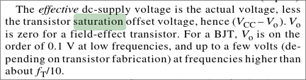

# KQ4TVW's radio notes
This is an attempt to put much of the random radio knowledge I'm trying to collect in one place for future reference. Radio is really hard and there are so many different things to understand and keep track of, so I thought I'd create a journal thing. Not sure where this is going to go, but I'll probably update this README when I find out :)

## Topics
- [Signal processing](dsp/)
- [Antenna design](antenna/)
- [Amplifier design](amplifier/)
- [Filter design](filter/)
- [Practical usage/application (tools, resources, etc)](application/)

I'm sure I'll think of more things to add, this is a WIP.

## Useful general resources
- https://pysdr.org/index.html
- https://www.electronics-notes.com/articles/radio/rf-mixer/fet-rf-mixer.php
- https://hackaday.com/2020/07/17/modern-radio-receiver-architecture-from-regenerative-to-direct-conversion/
- https://people.physics.anu.edu.au/~dxt103/160m/class_E_amplifier_design.pdf SATURATION VOLTAGE IS ZERO FOR A FET 

## [Journal](journal/)