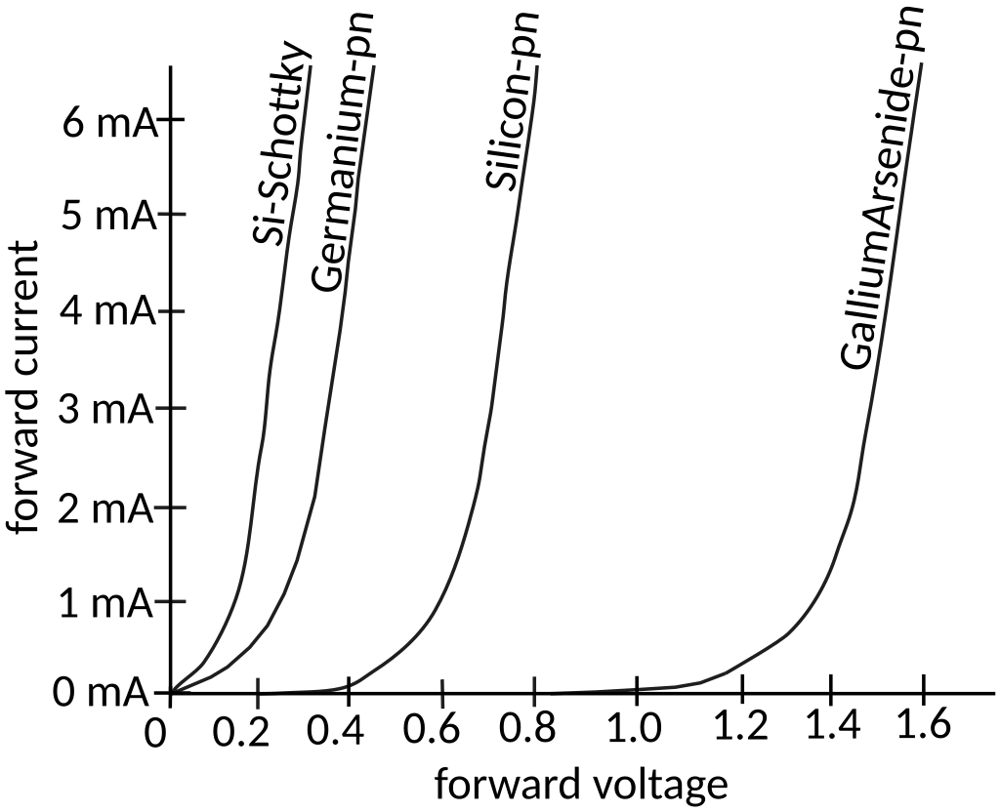

# Notes from this [amazing source](https://ludens.cl/Electron/RFamps/RFamps.html)

(I'm bored on a plane, am alive, and learning things seems like a good idea in the time I have, no internet connection but whatever)

"if you are really interested in the matter, you will need to work through it step by step"

## Amplifier types
- Class A: active device conducts current for the entire waveform (360deg), I believe the reason this is inefficient is because the active device is active all the time so losses are always present?
    - Theoretical maximum efficiency: 50% (why?)
- Class AB: in between
    - Theoretical maximum: 78.5%
- Class B: conducts current for exactly 1/2 of waveform (180deg)
- Class C: <1/2

Smaller conduction angle = higher efficiency but lower output power

So, why is Class A efficiency 50%? I found another article about common emitter amplifiers and Class A amplifiers, let's see: https://www.n5dux.com/ham/files/pdf/NorCal%2040A%20-%20PPTs/322Lecture18.pdf

This mentions one type of common emitter amplifier where the switching element Q always remains in the active region. I think this is the same as the definition of Class A.

What's the active region? Checking RD16HHF1 datasheet rn:

Well now I feel a bit silly but sure, I'll read a tutorial on transistors https://learn.sparkfun.com/tutorials/transistors/operation-modes

**The four transistor operation modes are:**
- Saturation -- The transistor acts like a short circuit. Current freely flows from collector to emitter. $V_E < V_B$, $V_C < V_B$
- Cut-off -- The transistor acts like an open circuit. No current flows from collector to emitter. $V_E > V_B$, $V_C > V_B$
- Active -- The current from collector to emitter is proportional to the base current. $V_C > V_B > V_E$
- Reverse-Active -- Like active mode, the current is proportional to the base current, but it flows in reverse. Current flows from emitter to collector (not, exactly, the purpose transistors were designed for). $V_C < V_B < V_E$

So what does this mean? I think forward active is the normal mode I'm used to seeing transistors in, the base acts as the switch to turn on or off current flow from collector to emitter (so the collector's voltage is higher than the emitter's voltage). However, "turn on or off" sounds just like operating in saturation or cutoff depending if there's voltage at the base or not? Maybe?

Never mind, it's definitely not, and that's weird, in saturation mode the base voltage is higher than the collector and emitter voltages and in cutoff the base voltage is lower than both. I've never actually taken the time to research these modes of operation before but seen them mentioned a lot. And I guess reverse active is just the inverse of active.

Also, PNP is backwards of this. I assume these apply to MOSFETs also? Never mind, they don't according to Google, because MOSFETs are **voltage-controlled** not current-controlled , and their modes are just cutoff, linear, and saturation. So that's basically the same but no reverse maybe?

### Saturation
on mode of a transistor, effectively a short between B and E, imagining a BJT transistor as two diodes is somewhat theoretically accurate (--N-- C<-B --P-- B->E --N-- )

why are transistors asymmetric? why can't we swap C and E? apparently they are doped with different concentrations, should learn more of the materials science behind BJTs /shrug

I somewhat understand FETs now though!

Oh wait that actually makes sense! To get current to flow freely through here you have B >= C+0.7 and B >= E+0.7

Ok cool, so now what? How is saturation mode useful? (and in my application, $\overline{V_B > V_C}$)

Also, transistors aren't ideal, there's a voltage drop between E and C, so $V_E > V_C + 0.2$ or so

### Cutoff
Cutoff mode is the opposite, current isn't allowed to flow through either diode because the base voltage is less than either of the ends (although $V_{BE}$ can be up to 0.7V), womp womp, so the transistor is an open

### Active

The condition for this is $V_C > V_B > V_E$, i.e. $V_{BC} < 0$ and $V_{BE} > 0$

$V_{BE} > 0.7 V$ again, or whatever $V_{th}, V_{\gamma}, V_d$ is

Why does this conduct? 

"Base current enters the base region, and the charges flowing across the base-emitter junction do their best to annihilate the base-entering charges. Fortunately MOST of the charges provided by the emitter end up NOT INTERSECTING with the base-entering charges, instead being gathered up in the collector region. The ratio of miss-hit is the BETA."
from https://electronics.stackexchange.com/a/416819

ok so I kinda get it maybe? when charge carriers (holes) are injected into the base, charge carriers from the emitter (electrons) are attracted to the holes and try to neutralize them, but they end up missing and flowing towards the collector region instead? why is it permissible for this to happen across the reverse biased junction though

what does a reverse bias even mean? why does a diode diode?

aaaaaaaaaaaaaaaaaa

i would usually just move on here, but now i'm curious and i think actually beginning to understand fundamentals will REALLY help. time to change my MAC address to get 15 more minutes of free plane wifi.

### Diodes

Remember: threshold voltage exists (this is just a "it works this way", not how)

#### p-n junctions
n-side: has electrons, p-side has electron holes

#### depletion region
near boundary of p-n junction, and "is an insulating region within a conductive, doped semiconductor material where the mobile charge carriers dissipate, or been forced away by an electric field" (wikipedia)

.svg.png)

wheeeee a mat chem jumpscare!

ok so n-type has more electrons which are in theeeeeee conduction band (filled) and p-type has more holes which are in the valence band (empty)

so now at the junction, electrons from n-type conduction band migrate to holes in p-type valence band and vice versa

and they just annihilate each other through [recombination](https://en.wikipedia.org/wiki/Recombination_(physics))

"The net result is that the diffused electrons and holes are gone." poof!

OK so the majority charge carriers ($e^-$ in n-type and holes in p-type) are depleted near the center (both from moving to the other side and from being recombined), which is what the depletion zone is!

N-side is positively charged? does this make sense? yes, because electrons are missing, but counterintuitive at first glance. P-side is negatively charged for the same reason.

And once the electric field there gets strong enough, diffusion stops

Threshold voltage is the integral of the electric field across the depletion region, E&M should be very interesting

Forward biasing: narrows depletion region by applying voltage in opposition to the field, i.e. positive on P-side and negative on N-side

Reverse biasing is the opposite

ok I like kinda understand that? will definitely need to review it later

and a diode is just a p-n junction, so we can go back to transistors now

### Active mode again

Ok so that explanation was a pretty good one I guess? It somewhat makes sense anyway, when holes are flowing into the base negative charge carriers/electrons come from the emitter side of the base-emitter junction to go neutralize them, but they don't all hit holes (why?) and continue until they get to the collector side of the base-collector junction, where they are majority charge carriers anyway

Why don't electrons flow from the collector to the emitter? What prevents this process from going in reverse? I already wondered this earlier, but idk which side would have a higher doping concentration. We want electrons to flow from E to C, soo... maybe collector is doped less so that more electrons are available at the emitter to go neutralize the holes at the base, miss, and continue to the collector? then it's not an equilibrium?

HA let's go that's right (emitter much more heavily doped than collector) and I'm glad I took the time to think about it...let's see if my reasoning is correct

Yes partially: "The most common design goal for the emitter, is to make it efficient at transferring its majority carriers to the base (where they become minority carriers). The most common design goal for the collector is that the maximum $V_{CE}$ of the transistor is sufficient for practical applications. These two different design goals lead to the use of different doping concentrations in the emitter and in the collector." (https://electronics.stackexchange.com/a/643964)

yay! so maybe i can reason about things sometimes if i take the time to do it

so why again can the electrons make it through to the collector? https://electronics.stackexchange.com/a/278803 says two reasons: a thin base and less doping in the base

I'm sure I'm missing so much, but now I think I mostly understand how the active mode of a BJT works.

A current of holes is injected into the base (enough to overcome the 0.7V threshold of the silicon p-n junction). If this were just the bottom diode, then they help overcome the field in the depletion region and current can travel, yay! The same thing happens here, electrons are traveling from emitter/N-type to base/P-type, but now there's another N-type section on top where the electrons can sometimes make it to and they will because the base can't catch them all, so as you inject more current into the base of a BJT more electrons are attracted from the emitter and more electrons make it to the collector

So, BJTs provide linear current gain when in active mode, $I_C = \beta I_B$

#### BJT biasing?

So why do we need to bias a BJT? One obvious reason I can think of is to get above the 0.7V threshold, but I'm always hearing it's to choose what operating mode the BJT is in. And this makes sense for saturation anyway, base has to be higher than C and E and for cutoff base has to be lower than C and E, this either forward or reverse biases both p-n junctions.

Let's check the 2N3904 datasheet. $V_{CE(sat)} = 0.3V$ and $V_{BE(sat)} = 0.95V$ at maximum. So that means the base has to be at least this much above both for the transistor to enter saturation.

wait but where's $V_{BC}$, that's the other junction

If we want the transistor to act as a switch, I guess it should switch between saturation and cutoff? But apparently cutoff is also when there's no base current, which makes sense, nothing is happening

woahhhh wikipedia rabbit hole but this is SO smart https://en.wikipedia.org/wiki/Bandgap_voltage_reference

"For bipolar junction transistors (BJTs), the operating point is defined as the steady-state DC collector-emitter voltage $\displaystyle V_{\mathrm {ce} }$ and the collector current ${\displaystyle I_{\mathrm {c} }}$ with no input signal applied." (wikipedia)

why? warum?

Ok I think I might understand it now. Maybe. For saturation mode anyway. If we look at the datasheet, we see this chart:

~~This means that if we want to switch idk 100 mA, we need a base current of at least 3 mA? that doesn't make sense... because $V_{CE}$ is the **minimum** voltage needed for it to be in saturation, so like if we try 100 mA with a base current of only 2 mA it will be in cutoff. However, if we want to switch 100 mA with 5 mA, that's fine!~~

^ this is wrong, see below, the chart is for $V_{CE}$ when in **saturation** which would be zero if the transistor was perfect

Biasing for active mode: we only care about current.

This looks like a really good writeup: https://electronics.stackexchange.com/questions/663662/npn-bjt-linear-region-operation, reading over it right now

Remember: $V_{CE} = 0$ when the transistor is conducting fully, except it can't be zero because transistors aren't ideal.

Hypothetical: want to switch 30 mA, $\text{V}_{\text{cc}} = 12\text{V}$, $\text{V}_\text{be} = \text{0.7V}$, $\text{I}_\text{b} = 4 \text{mA}$
(this is a beta of less than 10, gain-bandwidth product is 300 MHz / 28 MHz = 10.7)

Need to solve for $R_c$ and $R_b$

On that chart, for the curve where $I_c = 30 mA$, $V_{ce} = 0.1V$ when $I_b = 4 mA$

So what does this tell us now?

$R_b = V_{be} / I_b = 3.3V / 4 mA = 825 \Omega$

$R_c = (V_{cc} - V_{be}) / I_c = 11.3 V / 100 mA = 376 \Omega$

LTspice time, but going to push first

oops i did it wrong, will look more later

"Try to think of a BJT as a bad delivery service: you are in base and ask for a carrier; the emitter ships one to you but it gets snatched by the evil collector. You are still waiting for your carrier, so the emitter ships another one, and this one too is snatched by the collector. Out of 100 carriers, only one makes it to your contact in base. But in order to get that one carrier you have to ask for it, by means of the base current. Stop the base current and the emitter will stop the deliveries." is a good explanation: https://electronics.stackexchange.com/a/654231