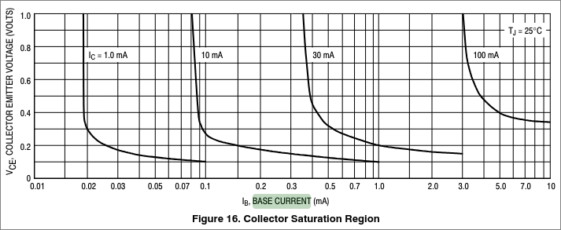

# Notes from this [amazing source](https://ludens.cl/Electron/RFamps/RFamps.html)

(I'm bored on a plane, am alive, and learning things seems like a good idea in the time I have, no internet connection but whatever)

"if you are really interested in the matter, you will need to work through it step by step"

## Amplifier types
- Class A: active device conducts current for the entire waveform (360deg), I believe the reason this is inefficient is because the active device is active all the time so losses are always present?
    - Theoretical maximum efficiency: 50% (why?)
- Class AB: in between
    - Theoretical maximum: 78.5%
- Class B: conducts current for exactly 1/2 of waveform (180deg)
- Class C: <1/2

Smaller conduction angle = higher efficiency but lower output power

So, why is Class A efficiency 50%? I found another article about common emitter amplifiers and Class A amplifiers, let's see: https://www.n5dux.com/ham/files/pdf/NorCal%2040A%20-%20PPTs/322Lecture18.pdf

This mentions one type of common emitter amplifier where the switching element Q always remains in the active region. I think this is the same as the definition of Class A.

What's the active region? Checking RD16HHF1 datasheet rn:

Well now I feel a bit silly but sure, I'll read a tutorial on transistors https://learn.sparkfun.com/tutorials/transistors/operation-modes

**The four transistor operation modes are:**
- Saturation -- The transistor acts like a short circuit. Current freely flows from collector to emitter. $V_E < V_B$, $V_C < V_B$
- Cut-off -- The transistor acts like an open circuit. No current flows from collector to emitter. $V_E > V_B$, $V_C > V_B$
- Active -- The current from collector to emitter is proportional to the base current. $V_C > V_B > V_E$
- Reverse-Active -- Like active mode, the current is proportional to the base current, but it flows in reverse. Current flows from emitter to collector (not, exactly, the purpose transistors were designed for). $V_C < V_B < V_E$

So what does this mean? I think forward active is the normal mode I'm used to seeing transistors in, the base acts as the switch to turn on or off current flow from collector to emitter (so the collector's voltage is higher than the emitter's voltage). However, "turn on or off" sounds just like operating in saturation or cutoff depending if there's voltage at the base or not? Maybe?

Never mind, it's definitely not, and that's weird, in saturation mode the base voltage is higher than the collector and emitter voltages and in cutoff the base voltage is lower than both. I've never actually taken the time to research these modes of operation before but seen them mentioned a lot. And I guess reverse active is just the inverse of active.

Also, PNP is backwards of this. I assume these apply to MOSFETs also? Never mind, they don't according to Google, because MOSFETs are **voltage-controlled** not current-controlled , and their modes are just cutoff, linear, and saturation. So that's basically the same but no reverse maybe?

### Saturation
on mode of a transistor, effectively a short between B and E, imagining a BJT transistor as two diodes is somewhat theoretically accurate (--N-- C<-B --P-- B->E --N-- )

why are transistors asymmetric? why can't we swap C and E? apparently they are doped with different concentrations, should learn more of the materials science behind BJTs /shrug

I somewhat understand FETs now though!

Oh wait that actually makes sense! To get current to flow freely through here you have B >= C+0.7 and B >= E+0.7

Ok cool, so now what? How is saturation mode useful? (and in my application, $\overline{V_B > V_C}$)

Also, transistors aren't ideal, there's a voltage drop between E and C, so $V_E > V_C + 0.2$ or so

### Cutoff
Cutoff mode is the opposite, current isn't allowed to flow through either diode because the base voltage is less than either of the ends (although $V_{BE}$ can be up to 0.7V), womp womp, so the transistor is an open

### Active

The condition for this is $V_C > V_B > V_E$, i.e. $V_{BC} < 0$ and $V_{BE} > 0$

$V_{BE} > 0.7 V$ again, or whatever $V_{th}, V_{\gamma}, V_d$ is

Why does this conduct? 

"Base current enters the base region, and the charges flowing across the base-emitter junction do their best to annihilate the base-entering charges. Fortunately MOST of the charges provided by the emitter end up NOT INTERSECTING with the base-entering charges, instead being gathered up in the collector region. The ratio of miss-hit is the BETA."
from https://electronics.stackexchange.com/a/416819

ok so I kinda get it maybe? when charge carriers (holes) are injected into the base, charge carriers from the emitter (electrons) are attracted to the holes and try to neutralize them, but they end up missing and flowing towards the collector region instead? why is it permissible for this to happen across the reverse biased junction though

what does a reverse bias even mean? why does a diode diode?

aaaaaaaaaaaaaaaaaa

i would usually just move on here, but now i'm curious and i think actually beginning to understand fundamentals will REALLY help. time to change my MAC address to get 15 more minutes of free plane wifi.

### Diodes

Remember: threshold voltage exists (this is just a "it works this way", not how)

#### p-n junctions
n-side: has electrons, p-side has electron holes

#### depletion region
near boundary of p-n junction, and "is an insulating region within a conductive, doped semiconductor material where the mobile charge carriers dissipate, or been forced away by an electric field" (wikipedia)

.svg.png)

wheeeee a mat chem jumpscare!

ok so n-type has more electrons which are in theeeeeee conduction band (filled) and p-type has more holes which are in the valence band (empty)

so now at the junction, electrons from n-type conduction band migrate to holes in p-type valence band and vice versa

and they just annihilate each other through [recombination](https://en.wikipedia.org/wiki/Recombination_(physics))

"The net result is that the diffused electrons and holes are gone." poof!

OK so the majority charge carriers ($e^-$ in n-type and holes in p-type) are depleted near the center (both from moving to the other side and from being recombined), which is what the depletion zone is!

N-side is positively charged? does this make sense? yes, because electrons are missing, but counterintuitive at first glance. P-side is negatively charged for the same reason.

And once the electric field there gets strong enough, diffusion stops

Threshold voltage is the integral of the electric field across the depletion region, E&M should be very interesting

Forward biasing: narrows depletion region by applying voltage in opposition to the field, i.e. positive on P-side and negative on N-side

Reverse biasing is the opposite

ok I like kinda understand that? will definitely need to review it later

and a diode is just a p-n junction, so we can go back to transistors now

### Active mode again

Ok so that explanation was a pretty good one I guess? It somewhat makes sense anyway, when holes are flowing into the base negative charge carriers/electrons come from the emitter side of the base-emitter junction to go neutralize them, but they don't all hit holes (why?) and continue until they get to the collector side of the base-collector junction, where they are majority charge carriers anyway

Why don't electrons flow from the collector to the emitter? What prevents this process from going in reverse? I already wondered this earlier, but idk which side would have a higher doping concentration. We want electrons to flow from E to C, soo... maybe collector is doped less so that more electrons are available at the emitter to go neutralize the holes at the base, miss, and continue to the collector? then it's not an equilibrium?

HA let's go that's right (emitter much more heavily doped than collector) and I'm glad I took the time to think about it...let's see if my reasoning is correct

Yes partially: "The most common design goal for the emitter, is to make it efficient at transferring its majority carriers to the base (where they become minority carriers). The most common design goal for the collector is that the maximum $V_{CE}$ of the transistor is sufficient for practical applications. These two different design goals lead to the use of different doping concentrations in the emitter and in the collector." (https://electronics.stackexchange.com/a/643964)

yay! so maybe i can reason about things sometimes if i take the time to do it

so why again can the electrons make it through to the collector? https://electronics.stackexchange.com/a/278803 says two reasons: a thin base and less doping in the base

I'm sure I'm missing so much, but now I think I mostly understand how the active mode of a BJT works.

A current of holes is injected into the base (enough to overcome the 0.7V threshold of the silicon p-n junction). If this were just the bottom diode, then they help overcome the field in the depletion region and current can travel, yay! The same thing happens here, electrons are traveling from emitter/N-type to base/P-type, but now there's another N-type section on top where the electrons can sometimes make it to and they will because the base can't catch them all, so as you inject more current into the base of a BJT more electrons are attracted from the emitter and more electrons make it to the collector

So, BJTs provide linear current gain when in active mode, $I_C = \beta I_B$

#### BJT biasing?

So why do we need to bias a BJT? One obvious reason I can think of is to get above the 0.7V threshold, but I'm always hearing it's to choose what operating mode the BJT is in. And this makes sense for saturation anyway, base has to be higher than C and E and for cutoff base has to be lower than C and E, this either forward or reverse biases both p-n junctions.

Let's check the 2N3904 datasheet. $V_{CE(sat)} = 0.3V$ and $V_{BE(sat)} = 0.95V$ at maximum. So that means the base has to be at least this much above both for the transistor to enter saturation.

wait but where's $V_{BC}$, that's the other junction

If we want the transistor to act as a switch, I guess it should switch between saturation and cutoff? But apparently cutoff is also when there's no base current, which makes sense, nothing is happening

woahhhh wikipedia rabbit hole but this is SO smart https://en.wikipedia.org/wiki/Bandgap_voltage_reference

"For bipolar junction transistors (BJTs), the operating point is defined as the steady-state DC collector-emitter voltage $\displaystyle V_{\mathrm {ce} }$ and the collector current ${\displaystyle I_{\mathrm {c} }}$ with no input signal applied." (wikipedia)

why? warum?

Ok I think I might understand it now. Maybe. For saturation mode anyway. If we look at the datasheet, we see this chart:

~~This means that if we want to switch idk 100 mA, we need a base current of at least 3 mA? that doesn't make sense... because $V_{CE}$ is the **minimum** voltage needed for it to be in saturation, so like if we try 100 mA with a base current of only 2 mA it will be in cutoff. However, if we want to switch 100 mA with 5 mA, that's fine!~~

^ this is wrong, see below, the chart is for $V_{CE}$ when in **saturation** which would be zero if the transistor was perfect

Biasing for active mode: we only care about current.

This looks like a really good writeup: https://electronics.stackexchange.com/questions/663662/npn-bjt-linear-region-operation, reading over it right now

Remember: $V_{CE} = 0$ when the transistor is conducting fully, except it can't be zero because transistors aren't ideal.

Hypothetical: want to switch 30 mA, $\text{V}_{\text{cc}} = 12\text{V}$, $\text{V}_\text{be} = \text{0.7V}$, $\text{I}_\text{b} = 4 \text{mA}$
(this is a beta of less than 10, gain-bandwidth product is 300 MHz / 28 MHz = 10.7)

Need to solve for $R_c$ and $R_b$

On that chart, for the curve where $I_c = 30 mA$, $V_{ce} = 0.1V$ when $I_b = 4 mA$

So what does this tell us now?

$R_b = V_{be} / I_b = 3.3V / 4 mA = 825 \Omega$

$R_c = (V_{cc} - V_{be}) / I_c = 11.3 V / 100 mA = 376 \Omega$

LTspice time, but going to push first

oops i did it wrong, will look more later

"Try to think of a BJT as a bad delivery service: you are in base and ask for a carrier; the emitter ships one to you but it gets snatched by the evil collector. You are still waiting for your carrier, so the emitter ships another one, and this one too is snatched by the collector. Out of 100 carriers, only one makes it to your contact in base. But in order to get that one carrier you have to ask for it, by means of the base current. Stop the base current and the emitter will stop the deliveries." is a good explanation: https://electronics.stackexchange.com/a/654231

https://positivefb.com/2021/06/19/bjt-amplifier-concept-to-components/

### works? in sim? even when you change the transistor?
some notes before i forget:
- capacitors between each stage are for AC coupling, they let the AC signal through but not the DC offset, and then the voltage divider after is to set the DC offset to correctly bias the transistor. i *think* they might help provide charge faster also? idk though
- emitter degeneration...honestly don't completely understand why it helps with stability yet but played around with resistor values until i found ones that worked...once i have more mental energy https://www.electronics-tutorials.com/amplifiers/emitter-degeneration.htm
- and that's about it! these are all standard component values too

- 33ohm: https://www.mouser.com/ProductDetail/Susumu/HRG3216Q-33R0-D-T1?qs=Pccw3SRxl2QVimWmCTvNQQ%3D%3D

Another important takeaway: this is more efficient (I think) because I'm not actually building a linear amplifier here, this is amplifying a square wave so switching the transistor between cutoff (<0.7V) and saturation (>0.7V)

Building this:

IRL: RD16HHF1 doesn't heat up at all when transmitting :( and no signal received. With the RD16HHF1 attached, voltage at its gate was like 0 instead of the intended bias of ~6.6V. So, I detached the RD16HHF1 and bias voltages were all correct to ~1.5V. So what's happening? I noticed my multimeter has a Hz measurement option, so I tried some different freqs (up to ~3M before multimeter just stopped measuring frequency) and they were mirrored at input and output! But that's not 28MHz, that's easier, so time to break out my SDR and use it as a spectrum analyzer. Results:
- 5MHz: -58 dBFS without battery attached, -47 dBFS with battery attached
- 28MHz: -46 dBFS without battery attached, -30 dBFS with battery attached

That looks good! What's the expected gain? 900 mW out with 20 mW in is a ratio of 45 which is 16.53 dB which at 28MHz is exactly what we got. so wtf is the problem?

(this makes sense too, about 10x current gain 8mA to 80mA and 4x voltage gain 3.3V to 12V)

-46 to -30

sooooo uh resistance between gate and source of the MOSFET is measured to be zero ohms. that's extremely suspicious: [gate oxide breakdown](https://www.sciencedirect.com/science/article/abs/pii/S0026271407000728)

pretty sure the RD16HHF1 is broken, going to take inside and measure another one to confirm

replaced the transistor with a theoretically working one (although slightly suspect solder joints), and nobody heard me on PSKReporter even though there were people listening on 10m in FM06 and people who heard other people on 10m in FM06. commands used (example):
`pinctrl set 17 op dl && sudo ./ft8 28074000 -a 0 "CQ KQ4TVW FM06" && pinctrl set 17 op dh && pinctrl set 17 op dl && sudo ./ft8 28074000 -a 220 "CQ KQ4TVW FM06" && pinctrl set 17 op dh`

concerningly, my transmission did show up on harmonics as well, but may have just overloaded my SDR? not sure. i'm guessing that's what happened. it was much weaker than I thought it would be though, like -20 dB with LNA and using a tiny wire as an antenna, I expected it would be strong enough to potentially hurt the SDR.

found a bad solder joint on a capacitor in series with the signal, reflowed it, still doesn't work :'(

Potential causes:
- Ground planes of two boards only attached in one place (through battery...this is an extremely long way for current to travel. maybe attaching the ground planes with a short wire is enough??)
- Many solder joints look suspicious, but read zero ohms anyway (esp. caps...the RD16HHF1 also)
- The new transistor also is broken (unlikely, gate and source have very high resistance between them)
- An inductor broke (unlikely probably since they're just wires?)
- A capacitor broke
- ~~I believe the preamp I built today works (see earlier in this document when I was using my SDR), so it's probably not that, but would need an oscilloscope to confirm. I did confirm that all the nodes I could measure were biased correctly afaict though.~~
- ~~Antenna bad? I don't think so since I was able to receive signals from Chile this morning~~

I guess the best course of action is probably to go reflow everything and see if that fixes it, but I don't want to do that right now :(

- Replace RD16HHF1 connection (did this by using the other TO220 slot (for the unused 7805) and some ugly hacks...)
- C1: replace with 120p (done)
- C2: replace with identical 100p (done)
- L2_a1: replace with identical 1.5uH (did this now)
- CS1: replace with identical 200p (did this now)
- CF1: fix GND connection (did this)

so uh idk if it's me or not, because propagation is crap tonight. :(

-50 w/ no power at all, -43 w/ no power to big amp, -30 with (but also this is the only path that exits via an antenna)

Tried replacing 47k to ground on the RD16HHF1 input with a 68k, and transistor seemed to get less warm weirdly, should have been hotter i think since longer time on?

i think i need a scope to see the output voltage of the preamp and the drain voltage of the MOSFET and get a 50ohm resistor and put it across the output and see how much voltage drop etc etc all requiring a scope :(

https://www.mouser.com/datasheet/2/115/DIOD_S_A0004873079_1-2542624.pdf

https://www.mouser.com/c/semiconductors/discrete-semiconductors/transistors/mosfets/?id%20-%20continuous%20drain%20current=200%20mA~~100%20A&mounting%20style=SMD%2FSMT&product%20type=GaN%20FETs%7C~JFETs~~MOSFETs%7C~RF%20JFET%20Transistors~~RF%20MOSFETs&qg%20-%20gate%20charge=900%20pC~~12%20nC&technology=Si&transistor%20polarity=N-Channel&vds%20-%20drain-source%20breakdown%20voltage=20%20V~~300%20V&vgs%20th%20-%20gate-source%20threshold%20voltage=0%20V~~1.2%20V&rp=semiconductors%2Fdiscrete-semiconductors%7C~Product%20Type~~semiconductors%2Fdiscrete-semiconductors%2Ftransistors%2Fmosfets%7C~Vgs%20th%20-%20Gate-Source%20Threshold%20Voltage%7C~Id%20-%20Continuous%20Drain%20Current%7C~Qg%20-%20Gate%20Charge%7C~Vds%20-%20Drain-Source%20Breakdown%20Voltage

https://assets.nexperia.com/documents/data-sheet/2N7002NXBK.pdf looks good

wait this looks awesome https://www.mouser.com/datasheet/2/196/Infineon_IRLML2060_DataSheet_v01_01_EN-3363619.pdf

https://positivefb.com/2021/06/19/bjt-amplifier-concept-to-components/

https://101-things.readthedocs.io/en/latest/ham_transmitter.html

https://101-things.readthedocs.io/en/latest/radio_receiver.html

I will have access to https://www.keysight.com/us/en/product/EDUX1052A/oscilloscope-50-mhz-2-analog-channels.html in about 20 days

2.4V - 17.4V at 10MHz, looks like a decent square wave

First 2N3904 biased to 1.28V. -240mV to 2.16V on base at 28.074MHz

Collector of first 2N3904: 5.12V - 10.2V at 28.074MHz

At 2.8 MHz, base is -1.1V to 2.1V and collector is 2.8V - 9.8V

At 10MHz, base is -1V to 2.1V and collector is 3.2V - 10.2V, still very clean

At 15MHz, starts getting clipped: base is -0.76V to 2.12V and collector is 2.88V to 10.3V, looks less like a square and not being driven low as strongly. Rise time: 15ns, fall time: 20ns. Image has 15MHz written on it.

18MHz: collector is 4V - 10.2V

20MHz: collector is 4.4V - 10.2V

28MHz: base is -0.3V - 2.1V, collector is 5.6V - 10.2V.

The base of the second stage 2N3904 is -2.4V to 2.5V, with collector going from 4.8V to 10.6V. not nearly enough swing to drive the RD16HHF1 :(

All below here has second stage disconnected

At 28.074MHz with second stage disconnected, the collector of the first 2N3904 is going from ~3.3V to 12.4V. It's basically a triangle though, not much of a square wave. Base is going from -0.24V to 2V (0-2.2V if lowest is at DC, so 1.1V dropped across a 330 ohm resistor, so 3.3mA in and (13.3 Vcc - (3.3 V + 1.0 Vbe)) = 9V across a 400ohm resistor so 22 mA which is a beta of like 5)

At 7.074MHz with second stage disconnected, it looks really nice, base going from -1.02V to 1.88V and collector going from 1.36V to 15.2V (:o).

Input before cap is 440mV to 3V with no power (at 28MHz, see prev photo)