Resources used:
https://www.reddit.com/r/amateurradio/comments/lt33rl/what_are_common_rf_power_transistors/
and PDFs linked here and https://people.physics.anu.edu.au/~dxt103/class-e/ and the actual Class E paper https://people.physics.anu.edu.au/~dxt103/160m/class_E_amplifier_design.pdf which tells me that $V_0 = 0 \text{V}$ for a FET and https://eng.libretexts.org/Bookshelves/Electrical_Engineering/Electronics/Microwave_and_RF_Design_V%3A_Amplifiers_and_Oscillators_(Steer)/04%3A_Power_Amplifiers/4.03%3A_Switching_Amplifiers_Classes_D_E_and_F and http://www.norcalqrp.org/files/Class_E_Amplifiers.pdf and **https://ludens.cl/Electron/RFamps/RFamps.html** (from a while ago when I was trying to design HPR amp) and uh a textbook which could be useful later  https://d1.amobbs.com/bbs_upload782111/files_45/ourdev_672470C259C6.pdf and https://www.qsl.net/va3iul/ is awesome and https://ocw.mit.edu/courses/6-976-high-speed-communication-circuits-and-systems-spring-2003/ is a great resource and specifically https://ocw.mit.edu/courses/6-976-high-speed-communication-circuits-and-systems-spring-2003/74927837820d5a11a2443b5b86ce0f50_guest3.pdf (guest lecture on power amplifiers)

Currently watching this video: https://www.youtube.com/watch?v=Tgrakttus3c

Notes:
- There are two main types of amplifiers: linear and nonlinear
- Linear amplifiers preserve the amplitude of the signal, nonlinear amplifiers don't
- Helpful graphic distinguishing the amplifier regions:
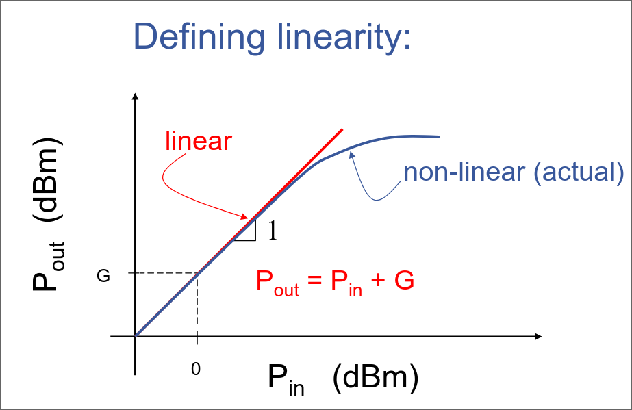
- 6.976: “Linear PA” generally refers to a PA which operates at constant gain, needs to preserve amplitude information, Useful for modulation schemes with amplitude modulation (QPSK, 8-PSK, QAM)
- 6.976: “Non-linear PA” generally refers to a PA designed to operate with constant PIN , output power varies by changing gain, Useful for constant-envelope modulation schemes (GMSK), **high efficiency**
    - **Class E apparently needs amplitude. So that's bad for QPSK.**
    - https://dsp.stackexchange.com/questions/51220/what-is-a-constant-envelope-modulation
    - Constant envelope: information carried in **phase** not amplitude, so ideally QPSK is constant-amplitude, but it's not in practice? idk need to read more, but it should definitely work for FT8 (frequency-shift keying is explicitly called out in https://en.wikipedia.org/wiki/Constant_envelope)
    - OK THIS MAKES SENSE WITH MORE SLEEP: https://dsp.stackexchange.com/questions/70411/use-of-pulse-shaping-in-digital-modulation. QPSK is modulating the amplitude of the in-phase and quadrature components, so it is effectively amplitude modulation and is not constant-envelope. Here's a time-domain image using my fft_by_hand.py program in this folder:
    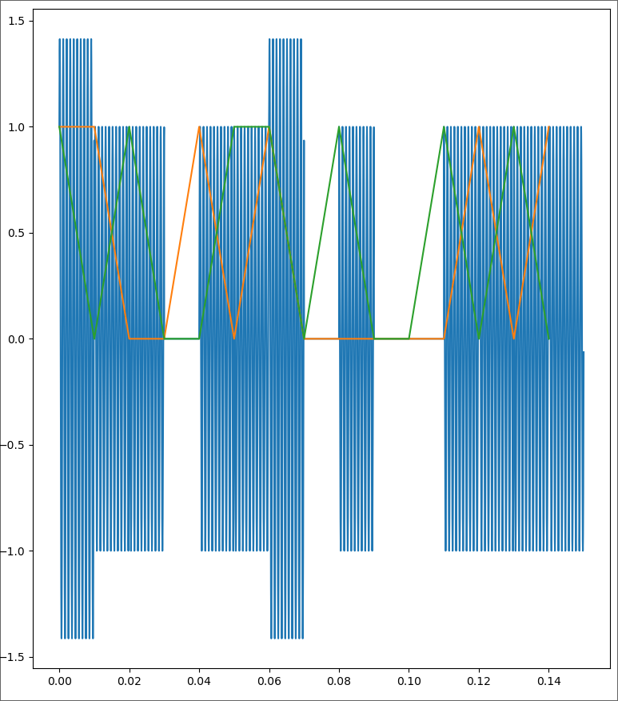
- Load-line theory: https://en.wikipedia.org/wiki/Load_line_(electronics) "The load line, usually a straight line, represents the response of the linear part of the circuit, connected to the nonlinear device in question. The points where the characteristic curve and the load line intersect are the possible operating point(s) (Q points) of the circuit; at these points the current and voltage parameters of both parts of the circuit match." **load line is shown in next image**

Making amps more efficient:
- Turning on transistor not all the time like in a linear amplifier, just some of the time
- Like in a Class B amplifier (Class A is a linear, not very efficient amplifier)
- Load line when this happens:
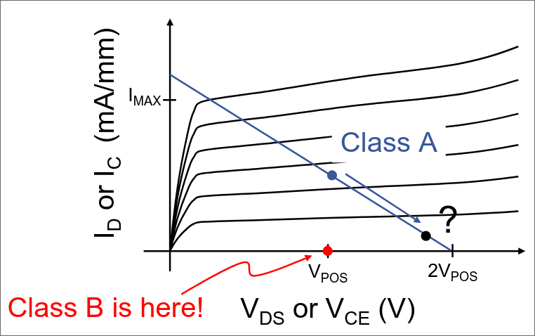
- This is more efficient because (from video) the transistor is either on or off; it's not on for the entire thing
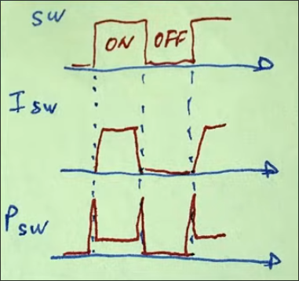

Class E:
- 1:30 in video
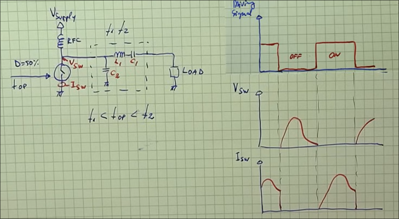
- Need 50% duty cycle
- RFC = radio frequency choke, blocks high-frequency AC
- Zero-voltage switching on turn-on and turn-off edges, zero current when switching, reduced losses during transition phases --> improved efficiency
- Can be built with single switching transistor
- Case study: 5 V, 0.5 W, 50 ohm impedance, 5 MHz
- Magical calculations to get:
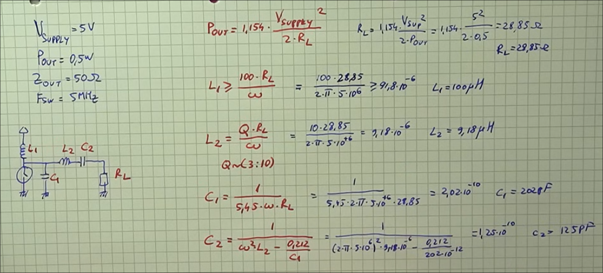
- Useful for calculating output power I think
- Q factor for matching network is dimensionless, apparently low values are lossier but wider bandwidth https://www.reddit.com/r/rfelectronics/comments/1d7gwoz/q_factor_in_matching_networks/
- Using idealized switch instead of transistor
- Takes a bit to reach steady state
- Voltage on switch exceeds 18V with 5V input, huh. 4-5x supply voltage when selecting transistor.
- Comparing Q-factor:
    - Q = 10: more sine wavey, cleaner signal, narrower bandwidth
    - Q = 3: less sine wavey, larger harmonics, more distorted, wider bandwidth
- Formulas may not give best values, to evaluate check voltage in switching element
- Should look like:
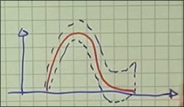
- How to optimize:
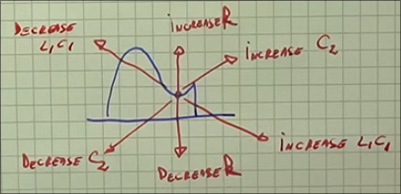
- Can confirm circuit is optimized by looking at current through switch
- Using a real transistor in LTspice?
- Used SI2304DS, max drain-source is 30V, max drain current is 1.7A
- Note: transistor already has output capacitance, can modify capacitor in parallel to be less

That was a GREAT video
https://www.youtube.com/watch?v=Tgrakttus3c

Build: (todo watch at a more reasonable hour) https://www.youtube.com/watch?v=qN18wjy5Xwc
- Used logic gate driver to drive MOSFET
- Doing PCB design, cool
- Thermal imaging to see where power is being lost :)
- Measure statements in LTspice
- This guy has a frequency generator, oscilloscope, and spectrum analyzer

Ok I should go to sleep, but this was really useful (and I think I now know why the amplifier was heating up so much when I was trying to transmit QPSK. I'd be interested to try just transmitting a square wave and seeing how that goes. I'll likely have to go with a linear amplifier for rocketry, should reference that MIT guest lecture at a more reasonable hour. Learning about radio stuff when I have lots of work to do ~~tomorrow~~today is probably not ideal but whatever, break is coming up soon :))

## My amplifier
oops this should be 10m (28mhz) not 10mhz, misleading name, my bad i was tired and don't want to rename rn
1. class_e_10mhz_orig.asc from tool
2. class_e_10mhz_optimized_ideal_components.asc after playing around, switching voltage waveform is much better
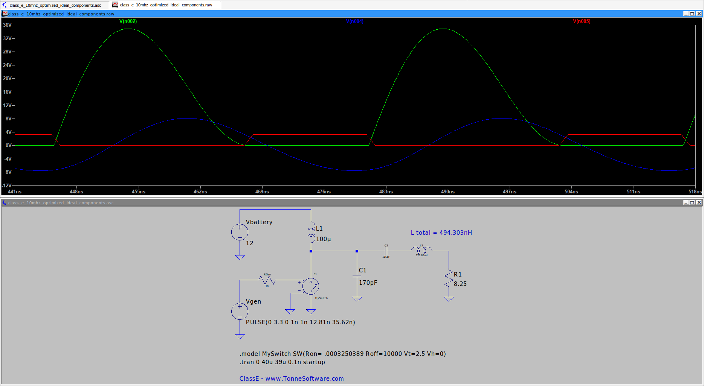
waittttt.... only 4W out of the resistor?
oh shoot increasing resistance would decrease power by equations in video. time to optimize more

2(a). Other optimization path: `class_e_10mhz_orig_opt2.asc` (more trial and error, idk how I got to increasing R in the previous one which decreases output power according to video eqns)

This is a LOT better:
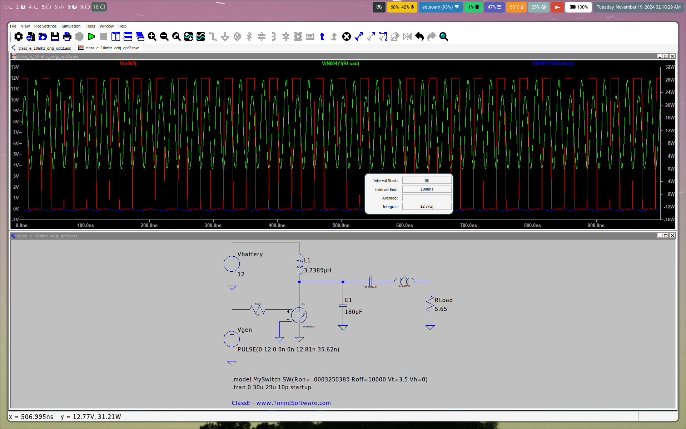

12.77 W out / 12.885 W in = 99% efficient...using theoretical components but I'm still very optimistic :)

3. class_e_10mhz_optimized_real_components.asc: looks really bad, didn't realize that the transistor I wanted to use (SPP21N50C3) has an output capacitance of **1200** pF when the largest capacitor in this is 150. time to find a different transistor oopsies, but this explains why I've been banging my head against the wall for a bit (:

could I use the one I already have? no, too low power for what I want to do :(

back to reddit thread https://www.reddit.com/r/amateurradio/comments/lt33rl/what_are_common_rf_power_transistors/

MRF101BN is $25 which is dumb but I'm just curious if it works in sim, is there a spice model?

https://www.mouser.com/datasheet/2/302/MRF101AN-1510799.pdf

Output capacitance is 43 pF, that's a lot more manageable

3(a). class_e_10mhz_opt2_real_components.asc

Trying https://www.qsl.net/in3otd/electronics/LDMOS_models/RD16HHF1/RD16HHF1_LTspice.html, capacitance of max 145 pF is a bit high but less than our 170 pF cap so might be fine? we'll see

https://ieeexplore.ieee.org/document/1523078 optimization help?

C2 (cap next to inductor right before load) is **very** important to the amount of power produced

https://www.mouser.com/ProductDetail/NXP-Semiconductors/AFT09MS015NT1?qs=7imfUp6rdT0GP%2F%252B8RBSTBw%3D%3D could be good also (rocketry as well!)

ok I really need sleep. current optimized model using RD16HHF1 has 13.233 W out / 15.242 W in = 86.8% efficiency which is not ideal but I need sleep and may use a different transistor anyway, using the AFT09MS015NT1 (linked above) would be good overlap with rocketry and allows me to test that one which i was thinking about using anyway

245am rambling is not fun, going to sleep now

### 11-19-2024 aka actual morning
Class E can *only* be used for a square wave; it erases amplitude modulation (forces a constant envelope waveform). 

RPiTX does amplitude modulation through varying the output power of the GPIO pin: https://groups.io/g/rpitx/topic/how_does_am_ssb_modulation/28976987

NanoVNA would be good to get

But back on task, according to Wikipedia, Class AB and Class D are the most commonly used audio amplifiers. 

wait this is cool https://github.com/threeme3/usdx. They use a Class E amplifier with envelope elimination and restoration (basically, split signal into phase and amplitude, give phase to Class E, and modulate the power going to Class E to correspond with amplitude) https://core.ac.uk/download/pdf/148657773.pdf

It'll be probably simpler to start with a Class AB amplifier.

Note from RFamps.html (linked at top):
"When building such an amplifier it's absolutely critical to minimize stray inductances. The 560pF capacitor needs to be soldered directly to the transistor's body, not one centimeter away. It needs to be a chip capacitor, because any wire terminals at all will contribute too much stray inductance. It's best to split it up into two capacitors of half the value, and solder them to the transistor on both sides of the drain terminal. Any deviation from this will make the amplifier behave less like the calculation indicates. And even if you follow these recommendations, you need to keep in mind that this design method is very simplistic, for example by not considering the inductance of the drain connection inside the transistor. One can usually get away with such simplifications at HF, but at 52MHz it's risky, and on even higher bands it definitely no longer works well enough. At VHF and higher one needs to design the matching network for the load impedance the transistor needs at its drain terminal, and not the one it needs inside, at its actual drain on the silicon chip. This load impedance needs to be looked up in the data sheet, which usually gives it for a single or a few operating frequencies and power levels. It often needs to be interpolated, if your application is not a completely standard one for the chosen transistor."

## Some kind of linear amplifier
This seems helpful:
https://www.electronics-tutorials.ws/amplifier/class-ab-amplifier.html

Or class B? this also seems helpful
https://www.allaboutcircuits.com/technical-articles/introduction-to-class-b-power-amplifiers/

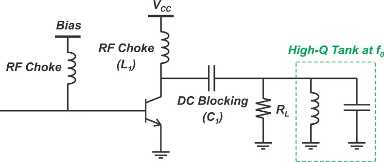

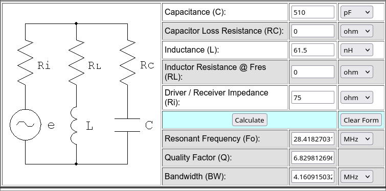

ok so for biasing we want the voltage added to be approximately the transition voltage I think

ok what about a single transistor tuned amplifier

https://ludens.cl/Electron/RFamps/RFamps.html

This seems useful

https://www.w6pql.com/1_kw_sspa_for_1_8-54_mhz.htm

Class A amplifier from same person with Class E video: https://www.youtube.com/watch?v=GtFnkXar5JU&list=PLT84nve2j1g_UO_7hj0HPrVwNj3NGQeES&index=6 Taking notes below
- Incredibly inefficient (25% normally)
- Class A: entire signal amplified by single element
    - Class B/Class C: broken up into chunks so multiple elements amplifying
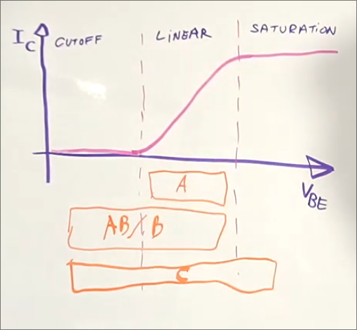
- Biasing required to keep transistor in linear region
- Gain is current dependent
- Closed-loop current control for good linearity -- stabilize gain at fixed value
    - Providing negative feedback
- If gain of amplifying element is high enough in negative feedback amplifier, then gain of entire amplifier only depends on attenuation $\beta$
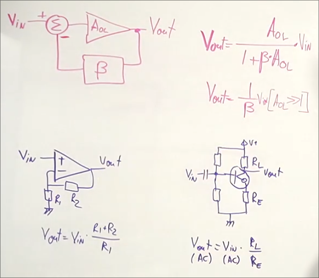
- Inductor opposes current flow
    - Interesting thing about inductors: voltage is derivative of current, kind of
    - Lets our amplifier go from 0V to 2VCC (-VCC to +VCC), increases max efficiency to 50%
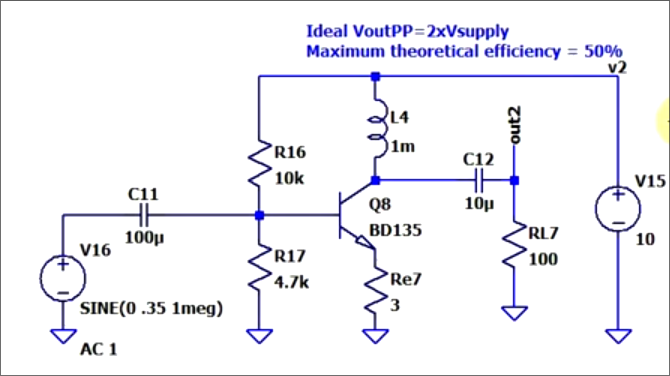
- Other approach: use transformer to remove DC
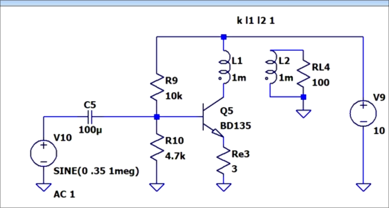
- Negative feedback loop is important
- Equations for design:
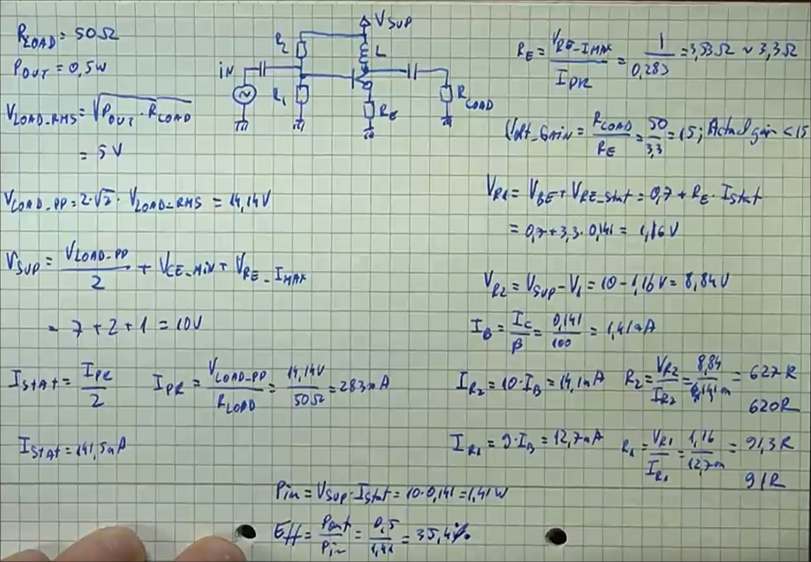
- Larger voltage drop across resistor --> more stable circuit

Let's say I want to build an amplifier for 15 W with a load resistor of 75 ohms (i think the load resistor impedance should match the antenna? idk need to learn more about impedance) then:
- $R_{load}=75\Omega$
- $P_{out}=15 \text{W}$
- $V_{loadRMS} = \sqrt{P_{out} \cdot R_{load}} = \sqrt{15 \cdot 72} = 33.54 V$
- $V_{loadPTP} = 2 \cdot \sqrt{2} \cdot V_{loadRMS} = 94.86\text{V}$
- $V_{supply} = \frac{V_{loadPTP}}{2} + V_{CE} + V_{REpeak} = 47.43 V + 3 V + 5 V \approx 55 V$
- Ohm's Law: $I_{peak} = \frac{V_{loadPTP}}{R_{load}} = 1.26 A$
- Current when amp isn't doing anything: $I_{static} = I_{peak}/2 = 630 mA$
- Emitter resistor: $R_E = \frac{V_{REpeak}}{I_{peak}} = 3.96 \Omega \approx 4 \Omega$
- Voltage gain: $g = \frac{R_{load}}{R_E} \approx 18.93$
- Voltage across $R_1$: $V_{R1} = V_{BE} (V_{GS} \text{for FET}) + V_{REstatic} = 3 V + (3.96 \Omega) \cdot (630 mA) = 5.5 V$
- Voltage across $R_2$: $V_{R2} = V_{supply} - V_{R1} = 49.5 V$
- Current at base: $I_B = \frac{I_c = I_{static}}{\beta} = 466 \mu A$
    - What's the gain of an FET? Only transconductance is listed
    - Apparently we can multiply transconductance by load resistance? idk, for the SPP21N50C3 we have a transconductance of 18 mho/siemens, so 18 * R_load = 18 * 75 = 1350? seems high but idk
- $I_{R2} = 10 \cdot I_B = 4.7 mA$
- $I_{R1} = 9 \cdot I_B = 4.2 mA$
- $R_1 = V_{R1}/I_{R1} = 5.5 V / 4.2 mA = 1309 \Omega$
- $R_2 = V_{R2}/I_{R2} = 49.5 V / 4.7 mA = 10607 \Omega$

I like MRF101AN
heck yeah we got a spice for it https://github.com/westonb/Plasma-Driver/blob/master/simulation/class_E_final.asc

80dB with filter, 64dB without

## A working (in simulation) 10 meter Class A amplifier!
Note: I'll probably end up using a Class E for this (the one I designed before) since I'll primarily be running FT8 or CW (haha definitely going to learn Morse *totally*) or other modes that just change frequency. This is partially because I don't want to touch a 55V power supply as my first amplifier. But it was good design practice, and I think I'll probably design a 435MHz Class A amplifier for rocketry.

(also technically this requires 6.6Vptp not 3.3Vptp...oops...my bad...may redesign but want to push first and probably won't actually build this rn anyway)

The file is `10_meter_class_a.asc`

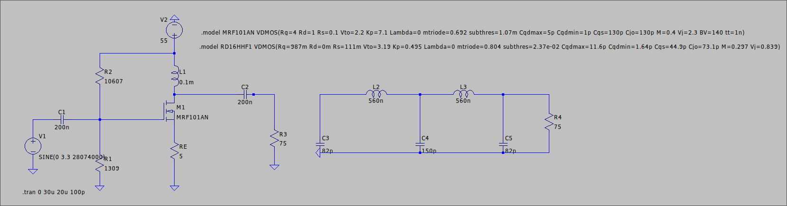

Behavior when amplifying a sine wave:
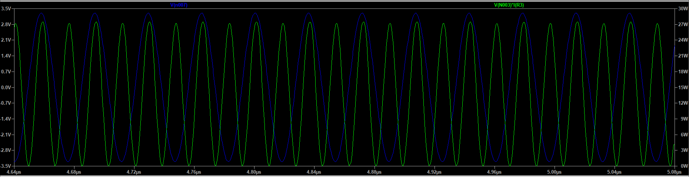

Behavior when amplifying a square wave:
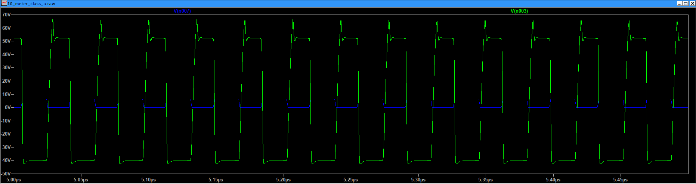

Efficiency when amplifying sine wave: 13.761 W out / 37.42 W in = 36.8%, not terrible for this kind of really inefficient amp

## Back to Class E
oops the sim had a 12V signal, 3.3 isn't enough for this transistor, finding another
https://www.mouser.com/c/semiconductors/discrete-semiconductors/transistors/mosfets/?id%20-%20continuous%20drain%20current=5%20A~~789%20A&mounting%20style=Through%20Hole&pd%20-%20power%20dissipation=16%20W~~-&vds%20-%20drain-source%20breakdown%20voltage=100%20V~~1.2%20kV&vgs%20th%20-%20gate-source%20threshold%20voltage=0%20V~~2.5%20V&rp=semiconductors%2Fdiscrete-semiconductors%2Ftransistors%2Fmosfets%7C~Vgs%20th%20-%20Gate-Source%20Threshold%20Voltage%7C~Id%20-%20Continuous%20Drain%20Current%7C~Pd%20-%20Power%20Dissipation%7C~Vds%20-%20Drain-Source%20Breakdown%20Voltage

I feel like this https://www.mouser.com/datasheet/2/196/Infineon_IPW50R280CE_DS_v02_02_EN-3360013.pdf should work, but it doesn't in LTspice

What about SPA21N50C3

WEEEE DID IT WITH a 3V3 SIGNAL LETS GOOOOOO RIGHT BEFORE CHECK IDK WHY THE COMMON EMITTER WAS SO HARD I WAS KINDA JUST TRYING STUFF WITHOUT THINKING SINCE IM TIRED

Ok so...that was with an idealized BJT to drive the MOSFET...we have to use an actual one.

With the ideal NPN BJT as a switch, the MOSFET is pulling about 300 mA maximum and about 80 mA RMS. That's why I can't drive it low enough with the transistors I'm trying (like 30mA max). So, I need to look for an RF transistor that can drive ~100mA+ of current. This is the one I tried https://www.mouser.com/ds/2/149/PN3563-889953.pdf but it didn't work.

That's wrong, it's trying its best but it literally cannot switch that fast.

http://eolstoragewe.blob.core.windows.net/wm-418498-cmsimages/Publications/ARJ_documents/2006no3/Vol97_No3_7.pdf

Next possible paths:
- Figure out how to drive this MOSFET from 3.3V, how much current do we need at 12V and how can we successfully amplify at high speed?
- Find a MOSFET with lower voltage
- Cry
- Just use the Class A

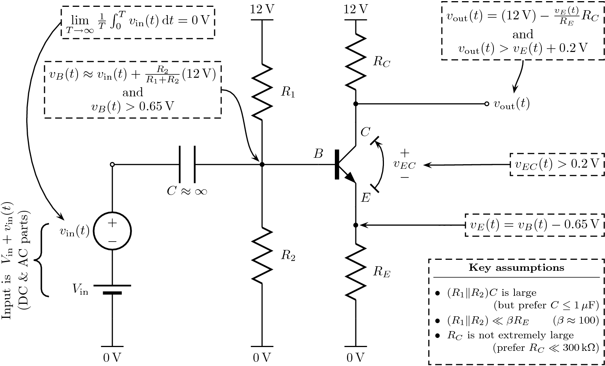

https://www.analog.com/media/en/technical-documentation/data-sheets/18189fb.pdf

IT WORKS WITH THIS MAGICAL HIGH SLEW RATE OPAMP
https://www.analog.com/media/en/technical-documentation/data-sheets/18189fb.pdf

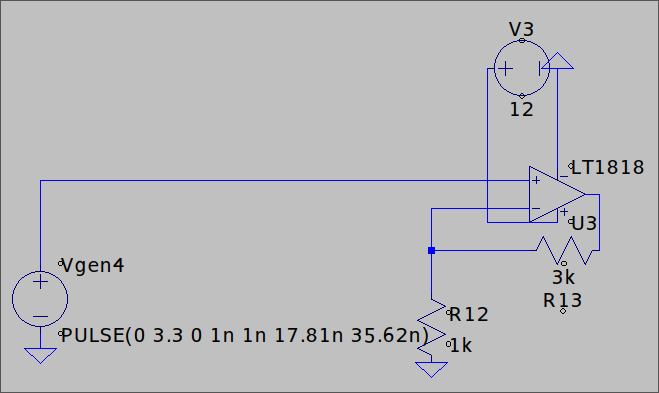
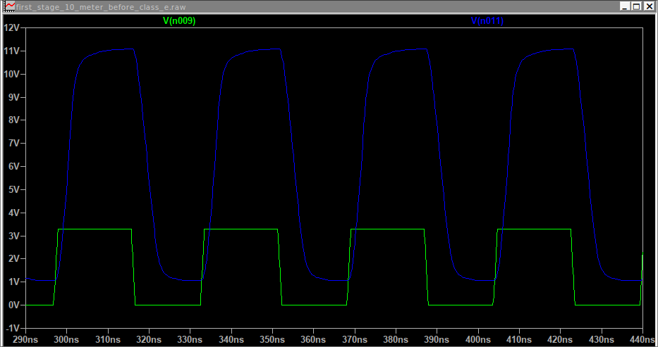
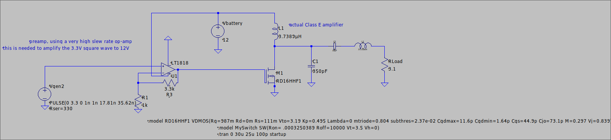

## `class_e_10mhz_opt2_real_components.asc` is the file
yes, this is 10 meters not 10mhz, naming files is hard at 2am

Low pass filter calc: https://markimicrowave.com/technical-resources/tools/lc-filter-design-tool/

Impedance matching calc: https://www.electronics-tutorials.ws/tools/t-pad-impedance-calculator.html

Line 254

## Updated to do impedance matching and low pass filtering
13.181 W / 15.672 W = 84% efficiency, not bad!
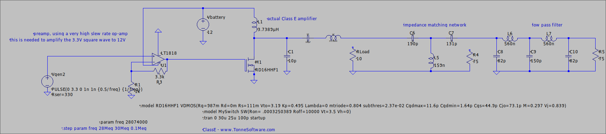

## BoM

Surface-mount and on a PCB will be important I think. Building the components separately (with 0 ohm resistors to connect them) will help, I think. I will likely need an oscilloscope for this...

### Preamp: $4.16
- 330 ohm resistor: I have a bunch of these
- LT1818 op-amp: https://www.mouser.com/ProductDetail/Analog-Devices/LT1818CS8PBF?qs=ytflclh7QUUppAef0n%252BGjw%3D%3D $4.16
- 3.3k ohm resistor: I might have one of these, will check
- 1k ohm resistor: I have a bunch of these
### Amplifier: $44.58
- RD16HHF1 transistor: https://hobbypcb.com/products/rd16hhf1-transistor-4-pack $25 for a 4-pack + $8 shipping
    - MRF101AN is also great, but it's $28 which is insane and I'd have to reoptimize the circuit
- 10 uH RF choke (this value doesn't matter as long as it's greater than or equal to 5): https://www.mouser.com/ProductDetail/EPCOS-TDK/B82144B2153K?qs=sGAEpiMZZMug9GoBKXZ75z2egS9EOetRez0MMm%252BK9K1rUJvIh%252BSBsg%3D%3D $0.59
- 10 pF capacitor: https://www.mouser.com/ProductDetail/KYOCERA-AVX/KGU21RCG2E100FU?qs=sGAEpiMZZMug9GoBKXZ758Gc9rwqdhh1nhfM76%2FweKsh%2Facwh1R%252BbQ%3D%3D $0.52 SMD
- 100 pF capacitor: https://www.mouser.com/ProductDetail/KYOCERA-AVX/600S101FT250XT4K?qs=sGAEpiMZZMug9GoBKXZ758Gc9rwqdhh1xAGGBmhEWTG8H2tLscT8VQ%3D%3D $1.79 SMD
- ~~373 nH inductor~~ obtained by these in parallel:
    - [1.5 uH inductor (1A)](https://www.mouser.com/ProductDetail/ABRACON/AIML-0805HC-1R5M-T?qs=sGAEpiMZZMug9GoBKXZ75%2FnYL8W%2FxAjS63UBWhrxAHlPYUZ3%252BE5ReA%3D%3D) $0.24 SMD 0805
        - 20% tolerance isn't ideal, but the circuit still produces ~12 W (vs ~13 W when proper values) so it's likely fine
    - [500 nH inductor (2.6A)](https://www.mouser.com/ProductDetail/Coilcraft/2929SQ-501GEC?qs=sGAEpiMZZMug9GoBKXZ75%252BsWPz3kIrHCnigL4O0yLFQ3SWhg742u4A%3D%3D) $3.43 SMD
### Impedance matching: $12.05
- ~~190~~ 180 pF capacitor: https://www.mouser.com/ProductDetail/KYOCERA-AVX/600F181FW250XT?qs=sGAEpiMZZMug9GoBKXZ75%252BHbCQrgMXFwLOjUM3zg8vUvUYuAtgmmTQ%3D%3D $3.26 SMD
- 130 pF capacitor: https://www.mouser.com/ProductDetail/KYOCERA-AVX/700A131FT150XC100?qs=7D1LtPJG0i24xk8ie5Hj5Q%3D%3D $8.44 SMD
    - This might be a weird value given the high price, try to find a less expensive one with a different value maybe
- 160 nH inductor https://www.mouser.com/ProductDetail/Walsin/WLQC2222H0JR16LB?qs=sGAEpiMZZMug9GoBKXZ75xcp4%2FGLqVYsVgu5JNq60%252Bq%252BXr9H0xxtQQ%3D%3D $0.36 SMD
### Low pass filter: $7.62
- 560 nH inductor: https://www.mouser.com/ProductDetail/ABRACON/AISC-1008-R56J-T?qs=sGAEpiMZZMug9GoBKXZ7556XAKv9YM6mdpnFQEVc0hrjPEIAkP6Q7w%3D%3D $0.24 SMD
- 560 nH inductor: https://www.mouser.com/ProductDetail/ABRACON/AISC-1008-R56J-T?qs=sGAEpiMZZMug9GoBKXZ7556XAKv9YM6mdpnFQEVc0hrjPEIAkP6Q7w%3D%3D $0.24 SMD
- 82 pF capacitor: https://www.mouser.com/ProductDetail/KYOCERA-AVX/600F820FT250XT?qs=sGAEpiMZZMug9GoBKXZ755zCscuRgncV6nPae8Ctu8Pkp8r3nnIp%2FA%3D%3D $2.06 SMD
- 150 pF capacitor: https://www.mouser.com/ProductDetail/KYOCERA-AVX/600F151FT250XT?qs=No6TofSzqEbBIp%2Fhve1ScA%3D%3D $3.02 SMD
- 82 pF capacitor: https://www.mouser.com/ProductDetail/KYOCERA-AVX/600F820FT250XT?qs=sGAEpiMZZMug9GoBKXZ755zCscuRgncV6nPae8Ctu8Pkp8r3nnIp%2FA%3D%3D $2.06 SMD
### Miscellaneous
- Output SMA connector: 
- Connectors for battery (powerpoles probably)
- For operating near an outlet: 12V 2A power supply https://www.amazon.com/100-240V-Transformers-Switching-Applications-Connectors/dp/B077PW5JC3
- For operating away from an outlet: 12V battery, 12V battery charger
- 3 [zero ohm resistors](https://www.mouser.com/ProductDetail/Panasonic/ERJ-S1T0R00U?qs=9gtMhpKs0nGpAa0s5YUvaA%3D%3D) $1.83 for 10, SMD 2512
    - Note: from first glance it seems like we need to shove 12 W through these, but really, if we set the resistance to 50 milliohms (worst case for most of these), a max of 180 mW is flowing through

This person just used a drill on a double-sided PCB: https://people.physics.anu.edu.au/~dxt103/class-e/ (well specifically a Dremel)

Making PCBs is doable! https://www.instructables.com/How-to-make-2-sided-Printed-Circuit-Boards/

https://www.allaboutcircuits.com/tools/wire-self-inductance-calculator/

"ANY RF design will NOT work on 'Veroboard' and the simplest method is to build above a copper groundplane, 'Ugly style'.

However the best way is to produce a PCB which simplifies the whole process and makes it repeatable."

https://github.com/ucdart/UCD-EEC134

the RD16HHF1 is a TO-220 package MOSFET

crud i need to redesign this for 50 ohms of impedance, that's what all the connectors use

dipole is theoretically 72 ohms but drops to ~50

op amp: https://courses.csail.mit.edu/6.01/spring08/handouts/week8/week8Notes.pdf

New schematic on 50 ohms (130pF can be 120pF, doesn't affect much):
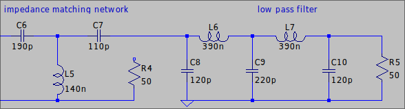

### Impedance Matching: $4.17
- [200 pF capacitor](https://www.mouser.com/ProductDetail/KYOCERA-AVX/600F201JT250XTV?qs=sGAEpiMZZMug9GoBKXZ758Gc9rwqdhh1w9J0EiG7ffSXqU4SG8338g%3D%3D) $1.80 SMD 0805
- [130 nH inductor (4A+)](https://www.mouser.com/ProductDetail/Walsin/WLQC2222H0GR13LB?qs=sGAEpiMZZMug9GoBKXZ75xcp4%2FGLqVYsdHMz1RgwXY51vEDoyOLhBw%3D%3D) $0.36 SMD weird mounting
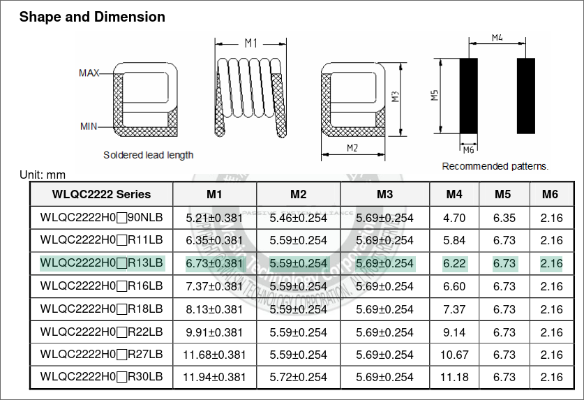
- [110 pF capacitor](https://www.mouser.com/ProductDetail/KYOCERA-AVX/600F111GW250XT?qs=sGAEpiMZZMug9GoBKXZ75%252BHbCQrgMXFw8lnyjHsl6qExor%252BjemU1qg%3D%3D) $2.01 SMD 0805

### Low pass filter: $16.18...ugh
- [120 pF capacitor](https://www.mouser.com/ProductDetail/KYOCERA-AVX/600F121FT250XT?qs=sGAEpiMZZMug9GoBKXZ755zCscuRgncVdf8XgiDHX3JaMoKC0HQhZw%3D%3D) $3.02 SMD 0805
- [390 nH inductor](https://www.mouser.com/ProductDetail/Coilcraft/2929SQ-391GEC?qs=sGAEpiMZZMug9GoBKXZ75%252BsWPz3kIrHCxiydFNyNS3QpiAQURGne4g%3D%3D) $3.44 SMD get pattern online
- [220 pF capacitor](https://www.mouser.com/ProductDetail/KYOCERA-AVX/600F221FT250XT?qs=sGAEpiMZZMug9GoBKXZ75%252BHbCQrgMXFwhajreLIhYA%252BRGwNzkWYuTg%3D%3D) $3.26 SMD 0805
- [390 nH inductor](https://www.mouser.com/ProductDetail/Coilcraft/2929SQ-391GEC?qs=sGAEpiMZZMug9GoBKXZ75%252BsWPz3kIrHCxiydFNyNS3QpiAQURGne4g%3D%3D) $3.44 SMD get pattern online
- [120 pF capacitor](https://www.mouser.com/ProductDetail/KYOCERA-AVX/600F121FT250XT?qs=sGAEpiMZZMug9GoBKXZ755zCscuRgncVdf8XgiDHX3JaMoKC0HQhZw%3D%3D) $3.02 SMD 0805

https://www.mouser.com/c/rf-wireless/rf-capacitors/?instock=y&sort=pricing

https://www.mouser.com/c/rf-wireless/rf-inductors/rf-inductors-smd/?instock=y&sort=pricing

What are the "HandSolder" pads in KiCAD?