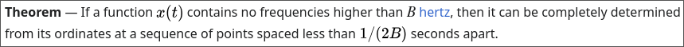
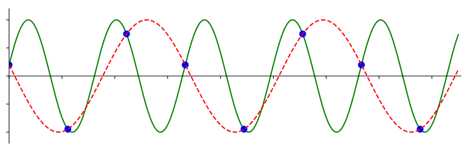
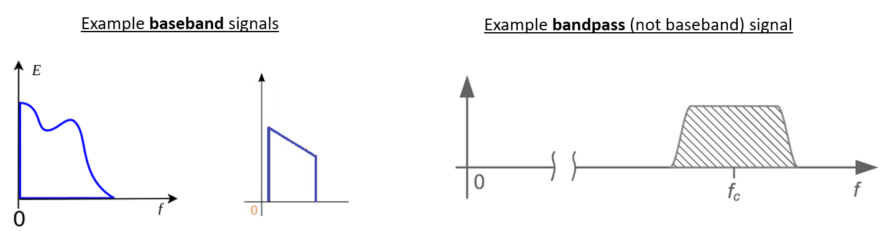
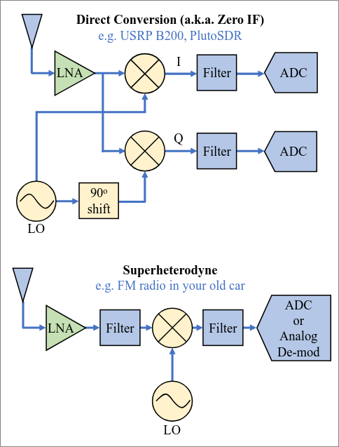

Note: heavily borrowing from https://pysdr.org/content/sampling.html, but trying to rewrite/rephrase so I understand it better

https://web.archive.org/web/20220613052830/http://rfic.eecs.berkeley.edu/~niknejad/ee242/pdf/eecs242_lect3_rxarch.pdf looks like a great presentation

- ### Sampling: grabbing amplitudes at various points in time, basically discretizing a continuous signal
- ### Nyquist rate: twice the highest frequency (bandwidth) of a given signal
    Sampling at this rate or higher allows us to completely determine the original signal. Useful Wikipedia article: https://en.wikipedia.org/wiki/Nyquist%E2%80%93Shannon_sampling_theorem
    
    and diagram from PySDR of what happens when you don't sample fast enough (in this case, $1.5f$):
    
- ### Baseband: signal at 0 Hz, not modulated onto a carrier wave
- ### Passband: signal modulated with carrier wave at higher frequency
- ### Downconversion: shifts signal from carrier frequency (passband) down to 0 Hz (baseband)
    PySDR image to help:
    

## How does downconversion work?

- *magic* just kidding, it uses a **mixer**, which "produces new signals at the sum and difference of the original frequencies" ([Wikipedia](https://en.wikipedia.org/wiki/Frequency_mixer)) and is represented by a multiplication symbol in a diagram. How do those work? [It's complicated](https://www.analog.com/media/en/training-seminars/design-handbooks/Basic-Linear-Design/Chapter4.pdf). But one way is to use a ring of diodes apparently? This isn't too relevant for what I'm trying to do (my SDR just has one inside it), but I am curious how they work -- it's annoying to just chalk it up to *magic*.
- The mixer is driven by a **local oscillator** set to a target frequency.

## I/Q sampling
Let's look at the diagram above. The superheterodyne receiver seems like a really nice way to do things; why do we need I/Q sampling/direct conversion?
First, let's define what I and Q are:
- I/Q: in phase and quadrature components, two sinusoids that are $90\degree$ out of phase with each other (e.g. sine and cosine)

Ok, great, now we've got that over with, back to theory. Why are we using I/Q sampling instead of a simpler superheterodyne receiver? If I read [this StackExchange answer](https://dsp.stackexchange.com/questions/37627/why-do-sdr-receivers-emit-i-q-samples) correctly, I *think* it's because you can get away with sampling slower using I/Q sampling (this goes back to the Nyquist rate).

We usually say that I is the cosine wave and Q is the sine wave: $x(t) = I \cos(2\pi ft) + Q \sin(2\pi ft)$ We usually represent I/Q samples as complex numbers, i.e. $I+Qj$ (using $j = \sqrt{-1}$ instead of $i$ to avoid confusion).

Note: the received signal will be out of phase with the transmitted signal, because the clocks started at different times. According to [this StackExchange answer](https://dsp.stackexchange.com/questions/76157/phase-offset-analysis-in-real-trsnsmitted-signal) (wow DSP StackExchange is very helpful here), "the algorithms to correct for this are typically part of the carrier recovery loop or carrier frequency offset correction in the receiver."