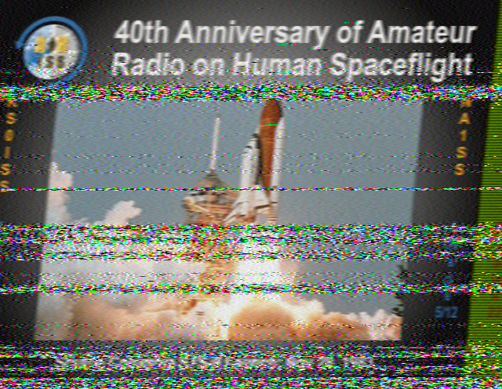
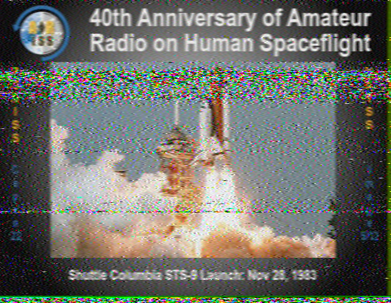
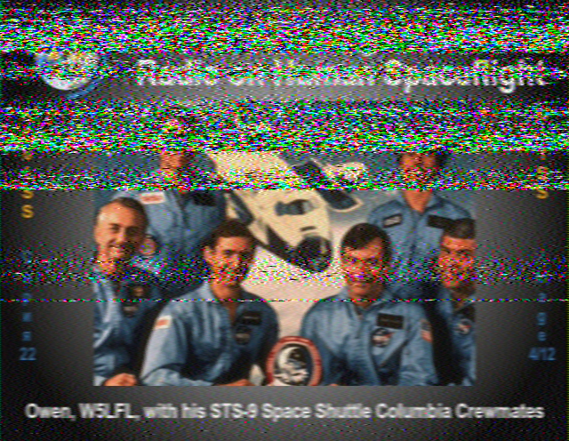
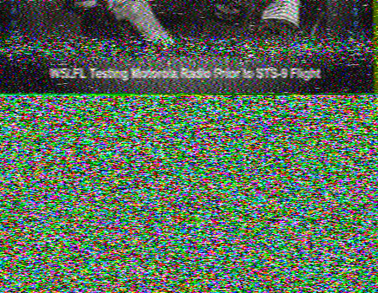
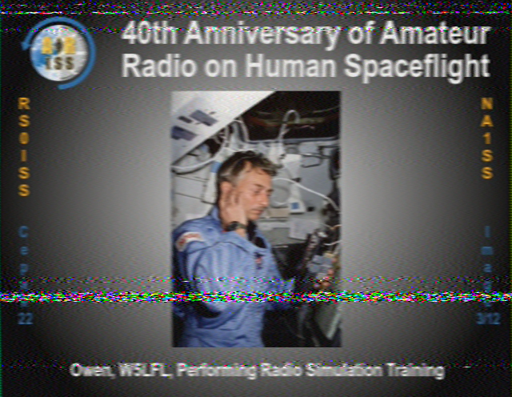
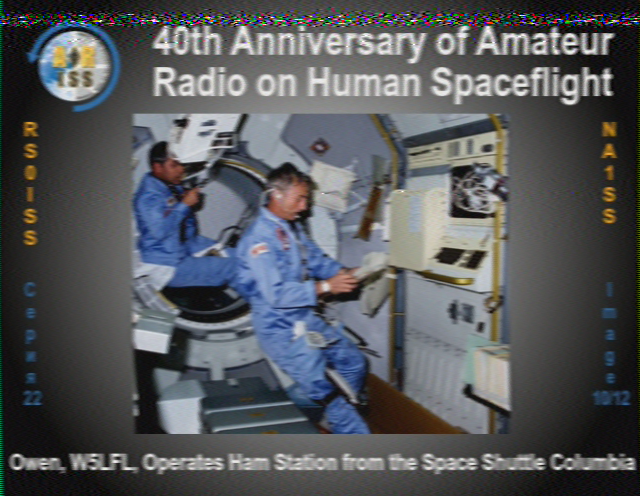

## 11-10-2024 to 11-18-2024: ISS SSTV!
### 11-10-2024
The ISS is having a special SSTV event this week on $145.800$ MHz! So, I stayed up late on the 10th building a 3-element Yagi-Uda antenna after doing some research. Last year, there was a holiday SSTV event that I built a giant corner reflector for, but that was using the cross-band repeater on $437.800$ MHz, so I couldn't use it for this event. Also, that antenna was giant, bulky, and heavy:

TODO insert image

So, I built a much lighter Yagi antenna out of a yardstick as the boom, wire hangers as the conductors, and hot glue to hold it all together. It's so much easier to hold!

TODO insert image

I decided to try simulating it in EZNEC -- it has a maximum gain of $6.93$ dB, a good deal more than a standard dipole ($2.16$ dB if I remember correctly):


### 11-11-2024
So, I left a robotics meeting to go to the top of a staircase at around 6:30pm on the 11th and point my antenna at a space station. The conflict was unfortunate, but the ISS timing would be harder to change :) I used `gpredict` to account for Doppler shift and give me the azimuth and elevation angles of the station (yaw and pitch I guess?), `gqrx` to receive the signal from my RTL-SDR dongle, and `qsstv` to decode the SSTV image. 

TODO insert image of setup



let's gooo! we got one :)

There was another pass at ~8:19pm on the 11th that I was less optimistic about (max angle: ~20 degrees, versus ~30 for the other one). I told some of my friends about my silly endeavor so was able to hear beeping (oops spoiler) along with other people:



And somehow this one was even better. Now time to research the theory behind how this works :) I'm not sure how my luck resulted in receiving the exact same image (out of 12) twice...such is life /shrug but I'm still really happy I got some and am excited to collect more over the course of the week! I love doing this :)

### 11-12-2024
Today was a pretty good day!

#### Pass #1

The first pass started at 5:53pm. I had an ultimate frisbee practice prior to this and got back on campus at 5:40pm, so I ran up four flights of stairs to my room to grab my antenna, ran back down, and went up three flights to the staircase I'm using as a high place. There are two different staircases on the same building on campus that are great for this purpose; one is **north-facing** (this one faces the main street on campus) with the building to the south, and the other is **south-facing** with the building to the north. Because most of these ISS passes are low on the horizon and the whole purpose of going up on a staircase is to get line-of-sight to it, I have to check each pass's azimuth to know whether to choose the north-facing or south-facing staircase. This pass was a south-facing pass (AOS at 195 deg SSW, peaking at 129 deg SE, LOS at 64 deg ENE), so I chose the south-facing staircase.

I started hearing a signal at 5:53:59pm, as the ISS's transmitter had just finished its initialization sequence. Great timing :) However, as I tracked the station using the compass on my phone, it just wasn't correct; I had to point my antenna in a different direction to try to get a better signal (sweeping it around after having a weak signal to find a stronger one). I then started to notice that my phone and watch compasses were **both returning incorrect values** (watch below, this should read ~90 degrees):


My image wasn't terrible, but it was definitely not ideal:


Luckily, I still had a few minutes before LOS, and knew another SSTV image would be coming in. I decided to mostly ignore my compass's advice and just remember that south was forward, east was left, and west was right from the direction I was standing. This worked out somewhat better, but I still didn't really know where to point; I just knew which direction the ISS was going (right) and that I should slowly move my antenna that way once my signal started getting weaker. However, at around 5:59, I saw a small white dot just to the left of a big tree, moving left very near to where I was pointing my antenna. IT'S THE ISS!!!!! Needless to say, tracking was trivial for the rest of the pass :) It was amazing to actually see the object I was receiving radio waves from; without that, I was kind of dissociated from the actual antenna I was receiving waves from. Oh, and here's the image -- you can probably tell the point when I saw the ISS and the image got clearer:



#### Pass #2

The second pass started at 7:29pm, and was north-facing. This meant I was facing a more central point of campus, and as I was setting up, I got accusatorily asked "you doing anything specific up there?" by an adult on campus. I excitedly replied I was receiving images from the ISS and got told to be careful :) The pass started pretty far left (246 deg WSW), and the ISS was actively transmitting an image, so I got part of it:



AND I SAW THE ISS AGAIN AND WAS ABLE TO POINT MY ANTENNA AT IT FOR A BIT!!


I'm 99% sure the tiny white dot inside the red circle is the ISS (proof by "trust me bro"). I definitely saw it, but the picture didn't come out great because of all the ambient lighting.

And then it disappeared behind a tree :( But I heard the initial sequence of beeps for the next image and pointed my antenna towards them (moved it and if it got quieter/more static-filled then I moved back), got a lock on a clear signal, and right when I heard the faintest hint of static I moved the antenna more to the right to follow the ISS. I mostly ignored my compass. And I got my best image so far!


This was a slightly weird feeling, because I was hearing a very clear signal (24.9 dB above the noise floor! -38.1 dBFS vs -63 dBFS noise floor) and had no clue where the ISS actually was, but I was just blindly pointing my antenna towards a signal.

Then it eventually emerged out of the right side of a big tree, but I couldn't really find it among the brighter objects in the sky and with the light pollution that pervaded the place I was standing. However, what was cool about the next image (yes I got three, let's gooooo) was that I could tell when LOS hit. The image was still being transmitted as LOS approached, and I had a very faint signal (the ISS was low on the horizon and being blocked by objects). I heard it very faintly as `gpredict`'s timer approached "LOS in 00:00", and then it just stopped (or maybe that's just the placebo effect of making up a very faint signal, but I think it was real :)). That was cool. Oh, and here's the image:


Overall, a really great radio day! 5 images is not too bad :)

### 11-13-2024
The saga continues...

#### Pass #1: 6:39pm
I anticipated this pass being **very** good. The maximum elevation was 68 degrees! This was the highest pass yet so far, and I was really excited :) However, it did present a bit of a thorny problem; because it crossed the entire sky:

I couldn't go to my normal staircase spot (half of the pass would be blocked by a building). So, I settled for a lower place but with buildings further away:

As AOS hit, I realized the station wouldn't be reachable for a bit, since I was so low down. I pointed my antenna towards the predicted location of the ISS and heard a very faint SSTV signal, but it wasn't strong enough to decode. And then it stopped, but I couldn't tell when. I've learned that the interval between the end of one image and the start of the next is two minutes, but because I didn't know when the first one ended, I didn't know when the next one would start, and it was harder to track the station because I didn't have a signal to point at. I decided to move to some more open space when I was waiting for the transmission. While standing near a giant concrete sundial on campus in the middle of a walkway spewing static out of my computer and holding a mutant yardstick, I saw a white dot rise above the brick building where our science classrooms are. IT'S THE ISS!!!!!

I pointed my antenna at the dot, greatly relieved that tracking was much easier and elated to actually see it (before I started this adventure and before I moved to campus, I'd often go outside to see the ISS cross the sky). Initially, there was no signal, and I was anxiously waiting.

And then, the static abated, and I heard a very clear "deeeeeeeee de-duh-de-duh-de-duh-de-duh-deeeee," the SSTV initialization sequence. In more quantitative terms, here's the spectrogram:


The subsequent two minutes were just lovely. I got to point my yardstick Yagi at the ISS, and could actually see brightly where the signal was coming from. I had a clear line of sight, reflected in the good-quality audio. I loved tracking the ISS across the sky and knowing that while I could only see photons with a wavelength of ~400-700 nm hitting my eyes from 254 miles away, invisible photons with a wavelength of ~2,000,000,000 nm from the same location were hitting and resonating with my antenna, resulting in sound waves with a wavelength of ~170,000,000 nm hitting my ears and different photons with a wavelength between ~400-700 nm showing an image on my screen celebrating this beautiful madness (oops a bit of a run-on but whatever):


```
RTL-SDR v3 with 3-element Yagi-Uda antenna (gain of approximately 6.88 dB)

-37 dBFS vs -63 dBFS noise floor (36 dBFS above), LNA = 25.6 dB
```

And then I had a challenge; the ISS was now going to be obstructed by the building where I live. I had two minutes to find a better north-facing location before the next image (to be mostly transmitted before LOS) began. So, I sprinted up three flights of stairs to get to the north-facing staircase. I got there and got the image :)


```
RTL-SDR v3 with 3-element Yagi-Uda antenna (gain of approximately 6.88 dB)

-50 dBFS vs -62 dBFS noise floor (12 dBFS above), LNA = 25.6 dB
```

LOS occurred at 6:50:08pm according to gqrx, and I expected the rest of the image to not render:


But somehow the signal stayed strong until 6:50:18pm, creating the full image seen above (before this one). I'm not sure how this happened (maybe signals bouncing off the atmosphere? can 2m do that?) but it was cool to receive the end of an image after LOS had already passed. Or maybe my computer's clock is off, that's definitely a possibility, although 10 seconds seems a bit much /shrug

Anyway, this pass was great. I was so happy to see the ISS and proud of my quick location-switching. And after it was over, an FTC person saw me being a radio nerd and asked me about it and we had a pretty good conversation :)

#### Pass #2: 8:17pm

This pass's maximum elevation was comparatively sad: 12 degrees. It went from west to northeast, so I again visited the north-facing staircase (leaving a rocketry meeting, where someone actually recognized that I had a Yagi antenna with me, early; I was late to this meeting because of the first pass. I think it's justified to miss rocketry to do space stuff :)). The same person as yesterday (who does FRC and used to go to a school with a very good FRC team) saw me up there and came up to say hi and join me. Radio is more fun with others, maybe that's why old white men are always ragchewing :) Anyway, that was cool. Because the angle was so low (or maybe this is just a skill issue), I heard the initialization sequence for the first image but `qsstv` wouldn't decode it until a bit later when I had a stronger signal. I heard the initialization sequence 2:03 into my audio file, but it was so weak and barely visible on a spectrogram (this was *after* messing with settings):


So `qsstv` took a while to pick it up (waited until a clearer signal could be locked on to), and I got this:


The next image was better; the ISS was higher in the sky. We thought we saw it behind a tree, but it was a plane :( oh well. Anyway, the image was decent for such a low angle: 


And here's an action shot of the antenna in use:


Very good day :) I'm going to go to sleep, but need to submit the SSTV reception reports from the second pass eventually.

### 11-14-2024
It was raining. I didn't want to destroy my SDR. Being inside sucks for signal strength. You win some, you lose some. On the bright side, I *think* I got two unique images, but am not sure :/


