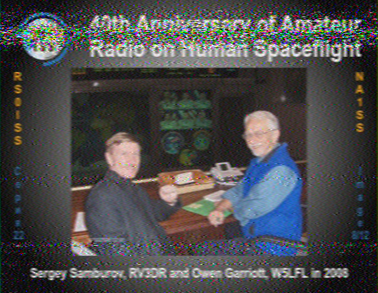

# 11-10-2024 to 11-18-2024: ISS SSTV! (+HF!)
### 11-10-2024
The ISS is having a special SSTV event this week on $145.800$ MHz! So, I stayed up late on the 10th building a 3-element Yagi-Uda antenna after doing some research. Last year, there was a holiday SSTV event that I built a giant corner reflector for, but that was using the cross-band repeater on $437.800$ MHz, so I couldn't use it for this event. Also, that antenna was giant, bulky, and heavy:

TODO insert image

So, I built a much lighter Yagi antenna out of a yardstick as the boom, wire hangers as the conductors, and hot glue to hold it all together. It's so much easier to hold!

TODO insert image

I decided to try simulating it in EZNEC -- it has a maximum gain of $6.93$ dB, a good deal more than a standard dipole ($2.16$ dB if I remember correctly):


### 11-11-2024
So, I left a robotics meeting to go to the top of a staircase at around 6:30pm on the 11th and point my antenna at a space station. The conflict was unfortunate, but the ISS timing would be harder to change :) I used `gpredict` to account for Doppler shift and give me the azimuth and elevation angles of the station (yaw and pitch I guess?), `gqrx` to receive the signal from my RTL-SDR dongle, and `qsstv` to decode the SSTV image. 

TODO insert image of setup


let's gooo! we got one :)

There was another pass at ~8:19pm on the 11th that I was less optimistic about (max angle: ~20 degrees, versus ~30 for the other one). I told some of my friends about my silly endeavor so was able to hear beeping (oops spoiler) along with other people:


And somehow this one was even better. Now time to research the theory behind how this works :) I'm not sure how my luck resulted in receiving the exact same image (out of 12) twice...such is life /shrug but I'm still really happy I got some and am excited to collect more over the course of the week! I love doing this :)

### 11-12-2024
Today was a pretty good day!

#### Pass #1

The first pass started at 5:53pm. I had an ultimate frisbee practice prior to this and got back on campus at 5:40pm, so I ran up four flights of stairs to my room to grab my antenna, ran back down, and went up three flights to the staircase I'm using as a high place. There are two different staircases on the same building on campus that are great for this purpose; one is **north-facing** (this one faces the main street on campus) with the building to the south, and the other is **south-facing** with the building to the north. Because most of these ISS passes are low on the horizon and the whole purpose of going up on a staircase is to get line-of-sight to it, I have to check each pass's azimuth to know whether to choose the north-facing or south-facing staircase. This pass was a south-facing pass (AOS at 195 deg SSW, peaking at 129 deg SE, LOS at 64 deg ENE), so I chose the south-facing staircase.

I started hearing a signal at 5:53:59pm, as the ISS's transmitter had just finished its initialization sequence. Great timing :) However, as I tracked the station using the compass on my phone, it just wasn't correct; I had to point my antenna in a different direction to try to get a better signal (sweeping it around after having a weak signal to find a stronger one). I then started to notice that my phone and watch compasses were **both returning incorrect values** (watch below, this should read ~90 degrees):


My image wasn't terrible, but it was definitely not ideal:


Luckily, I still had a few minutes before LOS, and knew another SSTV image would be coming in. I decided to mostly ignore my compass's advice and just remember that south was forward, east was left, and west was right from the direction I was standing. This worked out somewhat better, but I still didn't really know where to point; I just knew which direction the ISS was going (right) and that I should slowly move my antenna that way once my signal started getting weaker. However, at around 5:59, I saw a small white dot just to the left of a big tree, moving left very near to where I was pointing my antenna. IT'S THE ISS!!!!! Needless to say, tracking was trivial for the rest of the pass :) It was amazing to actually see the object I was receiving radio waves from; without that, I was kind of dissociated from the actual antenna I was receiving waves from. Oh, and here's the image -- you can probably tell the point when I saw the ISS and the image got clearer:


#### Pass #2

The second pass started at 7:29pm, and was north-facing. This meant I was facing a more central point of campus, and as I was setting up, I got accusatorily asked "you doing anything specific up there?" by an adult on campus. I excitedly replied I was receiving images from the ISS and got told to be careful :) The pass started pretty far left (246 deg WSW), and the ISS was actively transmitting an image, so I got part of it:


AND I SAW THE ISS AGAIN AND WAS ABLE TO POINT MY ANTENNA AT IT FOR A BIT!!


I'm 99% sure the tiny white dot inside the red circle is the ISS (proof by "trust me bro"). I definitely saw it, but the picture didn't come out great because of all the ambient lighting.

And then it disappeared behind a tree :( But I heard the initial sequence of beeps for the next image and pointed my antenna towards them (moved it and if it got quieter/more static-filled then I moved back), got a lock on a clear signal, and right when I heard the faintest hint of static I moved the antenna more to the right to follow the ISS. I mostly ignored my compass. And I got my best image so far!


This was a slightly weird feeling, because I was hearing a very clear signal (24.9 dB above the noise floor! -38.1 dBFS vs -63 dBFS noise floor) and had no clue where the ISS actually was, but I was just blindly pointing my antenna towards a signal.

Then it eventually emerged out of the right side of a big tree, but I couldn't really find it among the brighter objects in the sky and with the light pollution that pervaded the place I was standing. However, what was cool about the next image (yes I got three, let's gooooo) was that I could tell when LOS hit. The image was still being transmitted as LOS approached, and I had a very faint signal (the ISS was low on the horizon and being blocked by objects). I heard it very faintly as `gpredict`'s timer approached "LOS in 00:00", and then it just stopped (or maybe that's just the placebo effect of making up a very faint signal, but I think it was real :)). That was cool. Oh, and here's the image:


Overall, a really great radio day! 5 images is not too bad :)

### 11-13-2024
The saga continues...

#### Pass #1: 6:39pm
I anticipated this pass being **very** good. The maximum elevation was 68 degrees! This was the highest pass yet so far, and I was really excited :) However, it did present a bit of a thorny problem; because it crossed the entire sky:

I couldn't go to my normal staircase spot (half of the pass would be blocked by a building). So, I settled for a lower place but with buildings further away:

As AOS hit, I realized the station wouldn't be reachable for a bit, since I was so low down. I pointed my antenna towards the predicted location of the ISS and heard a very faint SSTV signal, but it wasn't strong enough to decode. And then it stopped, but I couldn't tell when. I've learned that the interval between the end of one image and the start of the next is two minutes, but because I didn't know when the first one ended, I didn't know when the next one would start, and it was harder to track the station because I didn't have a signal to point at. I decided to move to some more open space when I was waiting for the transmission. While standing near a giant concrete sundial on campus in the middle of a walkway spewing static out of my computer and holding a mutant yardstick, I saw a white dot rise above the brick building where our science classrooms are. IT'S THE ISS!!!!!

I pointed my antenna at the dot, greatly relieved that tracking was much easier and elated to actually see it (before I started this adventure and before I moved to campus, I'd often go outside to see the ISS cross the sky). Initially, there was no signal, and I was anxiously waiting.

And then, the static abated, and I heard a very clear "deeeeeeeee de-duh-de-duh-de-duh-de-duh-deeeee," the SSTV initialization sequence. In more quantitative terms, here's the spectrogram:


The subsequent two minutes were just lovely. I got to point my yardstick Yagi at the ISS, and could actually see brightly where the signal was coming from. I had a clear line of sight, reflected in the good-quality audio. I loved tracking the ISS across the sky and knowing that while I could only see photons with a wavelength of ~400-700 nm hitting my eyes from 254 miles away, invisible photons with a wavelength of ~2,000,000,000 nm from the same location were hitting and resonating with my antenna, resulting in sound waves with a wavelength of ~170,000,000 nm hitting my ears and different photons with a wavelength between ~400-700 nm showing an image on my screen celebrating this beautiful madness (oops a bit of a run-on but whatever):


```
RTL-SDR v3 with 3-element Yagi-Uda antenna (gain of approximately 6.88 dB)

-37 dBFS vs -63 dBFS noise floor (36 dBFS above), LNA = 25.6 dB
```

And then I had a challenge; the ISS was now going to be obstructed by the building where I live. I had two minutes to find a better north-facing location before the next image (to be mostly transmitted before LOS) began. So, I sprinted up three flights of stairs to get to the north-facing staircase. I got there and got the image :)


```
RTL-SDR v3 with 3-element Yagi-Uda antenna (gain of approximately 6.88 dB)

-50 dBFS vs -62 dBFS noise floor (12 dBFS above), LNA = 25.6 dB
```

LOS occurred at 6:50:08pm according to gqrx, and I expected the rest of the image to not render:


But somehow the signal stayed strong until 6:50:18pm, creating the full image seen above (before this one). I'm not sure how this happened (maybe signals bouncing off the atmosphere? can 2m do that?) but it was cool to receive the end of an image after LOS had already passed. Or maybe my computer's clock is off, that's definitely a possibility, although 10 seconds seems a bit much /shrug

Anyway, this pass was great. I was so happy to see the ISS and proud of my quick location-switching. And after it was over, an FTC person saw me being a radio nerd and asked me about it and we had a pretty good conversation :)

#### Pass #2: 8:17pm

This pass's maximum elevation was comparatively sad: 12 degrees. It went from west to northeast, so I again visited the north-facing staircase (leaving a rocketry meeting, where someone actually recognized that I had a Yagi antenna with me, early; I was late to this meeting because of the first pass. I think it's justified to miss rocketry to do space stuff :)). The same person as yesterday (who does FRC and used to go to a school with a very good FRC team) saw me up there and came up to say hi and join me. Radio is more fun with others, maybe that's why old white men are always ragchewing :) Anyway, that was cool. Because the angle was so low (or maybe this is just a skill issue), I heard the initialization sequence for the first image but `qsstv` wouldn't decode it until a bit later when I had a stronger signal. I heard the initialization sequence 2:03 into my audio file, but it was so weak and barely visible on a spectrogram (this was *after* messing with settings):


So `qsstv` took a while to pick it up (waited until a clearer signal could be locked on to), and I got this:


The next image was better; the ISS was higher in the sky. We thought we saw it behind a tree, but it was a plane :( oh well. Anyway, the image was decent for such a low angle: 


And here's an action shot of the antenna in use:


Very good day :) I'm going to go to sleep, but need to submit the SSTV reception reports from the second pass eventually.

### 11-14-2024
It was raining. I didn't want to destroy my SDR. Being inside sucks for signal strength. You win some, you lose some. On the bright side, I *think* I got two unique images, but am not sure :/


### 11-15-2024
Three passes. Two new images. Two repeated (today) images. Four unique images.

#### Pass #1: 5:03pm
So I was off campus (i.e. without my antenna, maybe that was a mistake to not bring it) with friends getting dinner, realized an ISS pass was coming up, started walking a bit faster, got on campus around 5:03pm (when the pass started), got to my room after running across campus and up four flights of stairs at ~5:06pm, opened my window, started up `gpredict`/`gqrx`/`qsstv` at 5:07:59pm, pointed my antenna out the window, and my effort somewhat paid off (although being inside still sucks):


I then realized the ISS would be moving northeast, and I was facing south. So, after the image was done being transmitted, I knew I had a two-minute window to move (TODO: would be cool to get a 437.800 MHz antenna as well so I could listen to the repeater while SSTV was inactive...ooh or two SDRs at the same time? idk). I speedwalked across hall to the most east-facing window on our west hall, opened it, and got a recognizable-ish image:


Also got a cool moon picture, it was big and yellow against a beautiful sunset:


#### Pass #2: 6:40pm
I actually had time to go outside (north-facing staircase) for this one, yay!

AND I COULD SEE THE ISS! For the first half or so of the first image, I didn't know where the station was (well I knew the predicted angle but tracking is hard and I think the magnetic field from the antenna messed up my compass in the past, maybe I should build a rotator sometime), but I then saw a white dot moving right emerge from behind a tree! That's why the second half image quality is so much better :) Oh also, this is a new image in my collection (#8):


Here's a [video](IMG_4029.MP4) of me tracking the ISS! :) (unfortunately this is between SSTV transmissions so you'll only hear static, oh well /shrug)

I could still see the ISS when the second transmission began, so got a MUCH better image:


ok maybe this is a bit of an exaggeration but it was pretty ok i guess

#### Pass #3 (:o): 8:19pm
I again went to the north-facing staircase for this one, there was a block party on the street that it overlooks so I got to hear music in the background of the SSTV sounds (oops spoiler)

Shortly after AOS hit, I started hearing a faint signal, but `qsstv` couldn't pick it up. I tried moving the antenna around a bit, but still nothing. I then oriented the antenna vertically instead of horizontally, and got a much clearer signal (yay!) and the end of a (new! #7) image:


Maybe the ISS has vertically polarized waves? idk i guess?


Anyway, I got the next image really well surprisingly! I initially was tracking the wrong position (fun fact: plane != ISS), but heard static so turned to a more ISSy direction and got a clearer signal. This was one of my better images:



I knew I *might* be able to get a tiny bit of the next image; this one finished with ~2:22 left. As LOS approached (0:22 left), I heard the SSTV initial sequence, but it was too quiet for `qsstv` to detect. I could see it on the waterfall, but the signal wasn't strong enough. Here's a [video](faint_init_signal.mp4) (see if you can catch the initial sequence)

Overall, pretty successful! :)

#### Pass #4, kinda
uhhhhhhhh idk why i was up but saw a pass was happening sooooo did the obvious thing i should go to sleep it's 1:23am

on the bright side got a better version of #7!


### 11-16-2024

Ooh boy I have a lot to write about :)

#### Pass #1: 5:51pm

I honestly forget a lot of what happened here, currently writing this on the 17th. These were the images I got (some of my best quality ones yet, especially the second one):


for #1/12
```
RTL-SDR v3 with 3-element Yagi-Uda antenna (gain of approximately 6.88 dB)

-43 dBFS signal, -63 dBFS noise floor, LNA set to 25.6 dB.
```

I recorded some videos of receiving these; the ISS was visible during this (yay!) so tracking was easy and I enjoyed being able to see what I was pointing my antenna at!

[Video 1](IMG_4042.MP4)

[Video 2](IMG_4043.MP4)

So now for the reason why I was distracted and can't remember much from this. The previous night, I learned that my RTL-SDR could do direct sampling to let me listen to HF. I had learned about the POTA program and wanted to listen to people transmitting on HF from parks. I tried running a wire across my room, but didn't receive much. As I was on 3rd Watts, I realized a good antenna candidate was literally right in front of my face:


So I did a very janky thing; I didn't have another antenna on me and the end of the dipole on my Yagi was exposed, so I poked it into the drainpipe.

[video of me listening to a random station (maybe Spanish? I forget if that was this or another station, it sounds like English so idk) on 7.220 MHz using AM](IMG_4045.MP4)

Oh, but I wasn't done yet. I saw that people were transmitting using the FT8 digital mode from the POTA website. I somehow remembered a question from my Technician license exam:

```
T4A04 (B)
How are the transceiver audio input and output connected in a station configured to operate using FT8?
A. To a computer running a terminal program and connected to a terminal node controller unit
B. To the audio input and output of a computer running WSJT-X software
C. To an FT8 conversion unit, a keyboard, and a computer monitor 
D. To a computer connected to the FT8converter.com website
```

I have **no idea** how I remembered that, but I went to go download WSJT-X while pushing the antenna into the drainpipe with my other hand (TODO get a better setup for this, it hurts to hold the antenna up for so long). I tuned to 14.074 MHz (20 meters), and initially wasn't getting anything because audio configuration is annoying (oops :)) But then I got my first three FT8 messages:
```
241116_232315    14.074 Rx FT8      1  0.9  557 KG5IIS HI8WJI FK58
241116_232315    14.074 Rx FT8    -13  0.6  748 CQ N0PDG EN36
241116_232315    14.074 Rx FT8    -12  0.5 1054 9V1YC KU5G EM15
```

I was initially disappointed that these weren't POTA activators. That's what I was looking for, and I couldn't find anything. Here's a screen recording of my first 13 minutes of listening, hopping around frequencies to try to find POTA people:

https://drive.google.com/file/d/1XBTSFVNjr-lqgHMiP6ITpqxAd5xV8D7n/view?usp=sharing

Then I saw this line:
```
241116_234800    14.074 Rx FT8    -15  0.5 1109 CQ CS8ABF HM77
```

Hmm. That seems like an interesting callsign, and HM77 is pretty far away (I'm in FM06). Let's check it out.

WHAT THEY'RE IN THE AZORES ISLANDS 2910 MILES AWAY

WHAAAAAAAT

So then I started looking up how 20m band propagation worked and such, and was amazed.

The really comical part of this is how focused I was on POTA. Before this happened, I just ignored this line:
```
241116_233000    14.074 Rx FT8    -11  0.9  599 CQ D2UY JI64
```
You can see me ignore this at around 6:03 in the video, and check if they were on the POTA list at around 8:15 in the video.

Then the Azores Islands incident happened, which caused me to be more vigilant about grid squares. I forget what got me to notice that **JI64** was very far from FM06 and look this location up, but uh


WHAT THE HECK

THAT IS SIX THOUSAND MILES AWAY (6502 specifically)

IN ANGOLA

WHAT IS HAPPENING

So then I looked up the callsign, D2UY, on QRZ, and they do in fact live in Angola.

So, who cares about the ISS 254 miles away, when you can talk to the Azores Islands (2910 miles away) and Angola (6502 miles away) literally using a **drainpipe**. Radio is amazing. After this, I texted my parents "I just used a drainpipe to receive signals from the Azores Islands and from Angola."

Oh also I had no idea that the inventor of WSJT-X, Joe Taylor (K1JT I think), is a **Nobel laureate** who is also an avid amateur radio operator and amateur radio launched his radio telescope career which he earned his Nobel Prize in Physics from. what????

#### Pass #2: 7:30pm, but who *really* cares
My notes from that pass:
- Needed to set LNA to ~44 dB (vs ~25.6 normal) to get 437.800
- Vertical antenna works better


After listening to an operator in Angola, the ISS is comparatively boring :)

### 11-17-2024

Won a frisbee tournament (dev states).

#### Pass #1: missed due to frisbee :(

#### Pass #2: 6:41pm

:( I thought this was going to be my last pass so was sad, this event has been a lot of fun!

images received:


#### And then the real fun begins: HF intermission

I did a lot of frequency hopping around here :) My logs are in [ft8_logs_nov_17.txt](ft8_logs_nov_17.txt) My **second** FT8 message received was:
```
241117_235600    14.074 Rx FT8    -19  2.3  359 CQ D2UY JI64
```

Hi again D2UY!!!!! Hope you're doing ok in Angola :)

I finally figured out that RR73 is __not__ a grid square in the middle of the ocean, it's "reception received, 73." oops :)

I haven't looked up all these locations yet, should find an automated way to map them but whatever. One of the most interesting exchanges I listened to was on 1.840 MHz, the 160 meter band where I definitely do not have permissions to transmit :( I saw a huge pileup when `4U1UN` from `FN30` called CQ, and was confused; FN30 is pretty close to FM06, so I didn't know what all the fuss:
```
241118_004930    14.074 Rx FT8    -16  0.5 1102 4U1UN VE3VHB -15
241118_004930    14.074 Rx FT8    -19  0.5 1146 4U1UN KA9PGC EN61
241118_004945    14.074 Rx FT8    -14  0.5  684 CQ 4U1UN FN30
241118_005000    14.074 Rx FT8    -17  0.6  684 4U1UN WA3LXD EL99
241118_005000    14.074 Rx FT8    -15  0.5 1102 4U1UN VE3VHB -15
241118_005000    14.074 Rx FT8    -19  0.5 1145 4U1UN KA9PGC EN61
241118_005000    14.074 Rx FT8    -20  0.4  882 4U1UN AB2NI FN20
241118_005015    14.074 Rx FT8    -18  0.5  684 CQ 4U1UN FN30
241118_005030    14.074 Rx FT8    -16  0.6  684 4U1UN WA3LXD EL99
241118_005030    14.074 Rx FT8    -19  0.5 1103 4U1UN VE3VHB -15
241118_005100    14.074 Rx FT8      1  0.5  880 4U1UN KK8X EM99
241118_005100    14.074 Rx FT8    -16  0.6  684 4U1UN WA3LXD EL99
241118_005100    14.074 Rx FT8    -11  0.6  750 4U1UN WF8Z EM79
241118_005130    14.074 Rx FT8     -5  0.6  750 4U1UN WF8Z EM79
241118_005130    14.074 Rx FT8     -1  0.5  880 4U1UN KK8X EM99
241118_005130    14.074 Rx FT8    -17  0.6  684 4U1UN WA3LXD EL99
241118_005130    14.074 Rx FT8    -12  0.5  806 4U1UN N9MB EN70
241118_005130    14.074 Rx FT8    -21  0.5 1102 4U1UN VE3VHB -15
241118_005145    14.074 Rx FT8    -15  0.6  684 N9MB 4U1UN -16
241118_005200    14.074 Rx FT8     -9  0.5  880 4U1UN KK8X EM99
241118_005200    14.074 Rx FT8     -8  0.5  806 4U1UN N9MB R-07
241118_005215    14.074 Rx FT8    -15  0.5  684 N9MB 4U1UN RR73
241118_005230    14.074 Rx FT8      7  0.5  880 4U1UN KK8X EM99
241118_005230    14.074 Rx FT8    -12  0.6  684 4U1UN WA3LXD EL99
241118_005230    14.074 Rx FT8     -1  0.5  806 4U1UN N9MB 73
241118_005230    14.074 Rx FT8    -18  0.4  983 4U1UN AB2NI FN20
241118_005230    14.074 Rx FT8    -22  0.7 1006 4U1UN K8ET EN66
241118_005245    14.074 Rx FT8    -14  0.5  684 WF8Z 4U1UN -18
241118_005300    14.074 Rx FT8      6  0.5  880 4U1UN KK8X EM99
241118_005300    14.074 Rx FT8      1  0.5  752 VE3SWS NI4L -10
241118_005300    14.074 Rx FT8    -15  0.4  983 4U1UN AB2NI FN20
241118_005300    14.074 Rx FT8    -18  0.5 1102 4U1UN VE3VHB -15
241118_005315    14.074 Rx FT8    -11  0.5  684 WF8Z 4U1UN -18
241118_005330    14.074 Rx FT8      9  0.5  752 VE3SWS NI4L RR73
241118_005330    14.074 Rx FT8     -4  0.5  880 4U1UN KK8X EM99
241118_005330    14.074 Rx FT8    -18  0.5  983 4U1UN AB2NI FN20
241118_005345    14.074 Rx FT8    -19  0.5  684 WF8Z 4U1UN -18
241118_005400    14.074 Rx FT8     -1  0.5  752 W3FAY NI4L -01
241118_005400    14.074 Rx FT8     -1  0.5  880 4U1UN KK8X EM99
241118_005400    14.074 Rx FT8    -17  0.5 1102 4U1UN VE3VHB -15
241118_005415    14.074 Rx FT8    -13  0.6  684 AB2NI 4U1UN -20
241118_005430    14.074 Rx FT8      4  0.5  880 4U1UN KK8X EM99
241118_005430    14.074 Rx FT8      5  0.5  752 W3FAY NI4L RR73
241118_005430    14.074 Rx FT8    -15  0.5 1102 4U1UN VE3VHB -15
241118_005430    14.074 Rx FT8    -21  0.8 1006 4U1UN K8ET EN66
241118_005515    14.074 Rx FT8    -17  0.5  684 AB2NI 4U1UN -20
241118_005530    14.074 Rx FT8     11  0.5  752 N8IBW NI4L -08
241118_005530    14.074 Rx FT8      4  0.5  880 4U1UN KK8X EM99
241118_005530    14.074 Rx FT8    -19  0.4  983 4U1UN AB2NI R+08
241118_005530    14.074 Rx FT8    -17  0.6  503 4U1UN AK4R +00
241118_005530    14.074 Rx FT8    -21  0.5 1103 4U1UN VE3VHB -15
241118_005530    14.074 Rx FT8    -20  0.8 1006 4U1UN K8ET EN66
```

was about. Then I looked up the station:

**United Nations Amateur Radio Club**

WHAAAAAAAT

THAT'S SO COOL

Apparently 4U1UN counts as its own country for DX, which is why that pileup happened. I wish I could transmit but am a lowly Technician for now :) (and I kinda need to build a transmitter for normal use first lol, probably rpi-based and building an amplifier since I need to know how to do that anyway for rocketry)

Shortly after this, back on 14.074 MHz, I saw this:
```
241118_005615    14.074 Rx FT8    -16  0.6  343 CQ IK4LZH JN54
```

JN54 looked pretty far away, so I decided to see what location it corresponds to (and look up the IK4LZH callsign). IK4LZH is a person located at:
```
VIA DEL SOSTEGNO 76
BOLOGNA 40131
Italy
```

WHAT

ANOTHER POND CROSSING

or should I say UN ALTRO ATTRAVERSAMENTO DELLO STAGNO

:)

And then shortly after, I saw a VERY interesting location:
```
241118_005800    14.074 Rx FT8    -18  0.7  451 K1CPR RW0SR OO22
```

**OO22**? **OO**? What the heck???
```
Vladimir Doronov
Koneva 20-244
Irkutsk 664043
Russia
```

whaaaaaaaat

привет!!!

i've only heard about Irkutsk in Risk before

how is this possible

Overall recap:

Heard Angola (D2UY), Russia/Irkutsk (RW0SR), Italy (IK4LZH) on 14.074. 20m propagation is insane. Other people in FM06 hearing too:


Also, I overheard that D2UY (Angola) talked with PY4EVS (Brazil)

#### 8:20pm pass

So this was the actual last pass of the event, which made me sad, because I thought I didn't get all of the images, and it's been so much fun to walk to the top of a staircase and point my homemade Yagi at the ISS while running into friends asking what the heck I'm doing and I get to tell them about radio. I'm really looking forward to the next event, and am so happy that it exists. Deorbit is going to hurt. I hope to actually talk to an astronaut sometime before that happens, we'll see :)

I got some okay images:


Using LNA=max (49.6 dB)

So I thought I didn't have all the images due to timing just not working out, and wanted to confirm my sadness before being sad. But...

# ISS image gallery

### #1/12: Received 11-16-2024 at 6:01pm


### #2/12: Received 11-12-2024 at 7:33pm


### #3/12: Received 11-12-2024 at 7:35pm


### #4/12: Received 11-12-2024 at 6:00pm


### #5/12: Received 11-11-2024 at 8:27pm


### #6/12: Received 11-11-2024 at 6:52pm
I thought I was missing this one. However, I got it on my very first pass and didn't include it here because I was rushing to write given excitement and it was bad quality. But it exists:


### #7/12: Received 11-16-2024 at 1:20am
The only mostly complete image I have of this is from inside at 1am (my other one has *maybe* 10 lines at the bottom)


### #8/12: Received 11-15-2024 at 8:25pm


### #9/12: Received 11-15-2024 at 6:49pm


### #10/12: Received 11-13-2024 at 6:46pm


### #11/12: Received 11-17-2024 at 6:49pm


### #12/12: Received 11-16-2024 at 7:36pm


**Stats**:
- All days except 11-14-2024 (rain) provided the best quality (or sometimes only) photos to be used here.
- 17 passes
- 36 images received
- 1 antenna built
- 2 antennas used (Yagi + drainpipe)
- Tangent to this, signals received from Angola, Italy, Russia, the UN, the Azores Islands using a drainpipe
- Hours ~~wasted~~: idk
- I want to transmit on HF now :)

This has been amazing. Like actually. It's been so much fun :) :) :)

I also got inspired to join the YARC (young amateur radio club) Discord server, so might become active there soon and asking questions and things. It seems like a really cool community!

Also I want to finish my SSTV decoding code, trying to write it in Haskell but working with binary data is annoying in Haskell (I also made the mistake of trying to read a file first instead of doing logic first....) so might use a different language (rust??). DSP is cool!